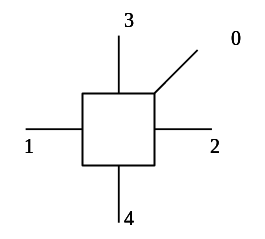

Networking in the CMP Simulator

# 1. Introduction 
In this document, the `network-on-chip module` and the `messaging protocols` will be introduced. In the simulator, the messages are inserted to the network by the cache system. Fig. 1 shows the overview of the messaging and networking system. 

  
Fig1. Overview of the messaging and networking system

# 2. Interface between the memory and NoC system
Logically, the cache system generates `messages` according to the protocol (e.g., MESI). Then the messages are injected into the network. In the simulator, the cache system and the network have different `event queues`. Fig. 1 shows the cooperation of the event queues. 

- The `dir events` are generated when `accessing cache` or in `directory operations`. 
- These `dir events` are inserted into the `dir queue` and messages with `EVG_ type` are inserted into the network. 
- The `EVG_ type` messages will be used to generate `ROUTER_ type` messages and traverse in the network. 
- After the destination router receives the `flit`, the events in the `dir queue` are compared against the flit info (e.g., the source, destination ID, message No. etc). If one of the event matches, the event will be popped from the `dir event` and put into the `dir fifo event queue`.
- The `dir fifo event queue` is checked to perform the necessary operation.

# 3. The network-on-chip module 
## 3.1 The message types
There are four types of messages as follows.
- EVG_: the highest level message,
  - Production. Messages of this type are produced by the `caches and directories`. 
  - Consumption. Function `receive_packet` calls `inject_packet`, to generate flits and put them into the `input buffers` of routers (`input_module_`).
- ROUTER_: in the network, messages of this type is generated to trigger the `polling of events` (messages) of the routers.
  - Production. Messages of this type are produced once a previous `ROUTER_ type message` is consumed. 
  - Consumption. Start the traversal of the `five pipeline stages` of the router. 
- WIRE_:  simulate the link traversal. 
  - Production. Messages of this type are produced in the `flit_traversal stage`.
  - Consumption. On reception of messages of this type, function `receive_flit` is called so that, flits are put into the downstream routers’ `input buffer`.
- CREDIT_: indicate the (output) `buffer status`, could be used as in adaptive routing. 
  - Production. In `flit_outbuffer` and `routing_decision` stage.
  - Consumption. Increase the downstream routers’ `output_module_.counter_`. 

## 3.2 Router pipelines

A router has five pipeline stages, i.e., routing decision, VC arbitration, SW arbitration, flit outbuffer, and flit traversal. The `input_module_` has a member variable `state_`, indicating which stage the `head flit` is in. 

### 3.2.1 Routing decision

The `input_module_.states_[in port #][vc #]` could be `ROUTING_`, indicating the `head flit`; or `HOME_`, indicating the `body or tail flit`; or `INIT_`, indicating `empty buffer`.

A routing function(e.g., XY ) is called to find out the `output port #`. If the destination of the flit equals to the ID of current node, the function `accept_flit` is called. The function accept_flit calls `popMsgComplete` to find an event in the `dir event queue` to match the message. This flit will no long enter the following stages. 

A `CREDIT_` type message will be generated to inform the downstream router about the `buffer status` of the current router. 

`input_module_.states_` is updated to `VC_AB_`.

### 3.2.2 VC arbitration

The input to this stage is `input_module_.states_.routing[][]`, indicating the (output port #, vc) request. 
- Call `vc_selection` function, select a free (output port #, vc) pair according to `output_module_.usage_[][]`; 
- Set up the `STL<map>` variable `vc_o_i_map`: (output port #, vc) -> vector of (input port #, vc). Find a `vc_win` among the (input port #, vc)’s;
- The winner sets `input_module_.crouting_[input port #][vc #]` to be (output port #, vc);
- `output_module_.usage_[output port #][vc #]` is set to be USED;.
- `output_module_.assign_[output port #][vc #]` is set to be (input port #, vc) ;
- `input_module_.states_[][]` is updated to `SW_AB_`.

### 3.2.3 SW arbitration

- Check the `output_module_.counter_` (whether the downstream router has sufficient buffers);
- The variable `vc_i_t` records all the input ports that requesting for this output port;
- Find a `crouting_[][]` in the `input_module_` and fill in the variable `vc_o_map`: output port # -> vector of `(input port #, vc)`. Find a `vc_win` among the (input port #, vc)’s;
- Find the flit in the `input_module_` according to `vc_win`;
- `input_module_.states_[][]` is updated to `SW_TR_`.

### 3.2.4 flit outbuffer

- Find the `crouting_[][]` in the `input_module_` in last stage to get the `(input port #, vc) -> (output port #, vc)` map;
- Decrease `output_module_.counter_[][]` and generate a `CREDIT_` type message;
- Remove the flit in the `input buffer` and add to the `output buffer`; 
- Add (output port #, vc) to `output_module_.outaddr`: output port # -> (output port #, vc);
- If the flit is TAIL, delete the flit in the output buffer;
- `input_module_.states_[][]` is updated to 
  - `ROUTING_`, if the input buffer is not empty and the first flit is HEAD, 
  - `SW_AB_`, if the input buffer is not empty and the first flit is BODY,
  - `INIT_`, if the input buffer is empty

### 3.2.5 flit traversal

	A message of `WIRE_` type is generated. The output buffer is deleted. 

## 3.3 Code to change topologies
Fig. 2 shows the IDs of the directions in each router. There are `three locations` related to the topologies, which are very similar in the code structure. 
  - In the `routing decision stage`, when the routing function is called. The indices of `routing_[][]` variable could be understood with the help of Fig. 2. 
  - In the `flit traversal stage`, when updating the value of `wire_pc_t` and `wire_add_t`.
  - In the `routing decision stage` and the `flit outbuffer stage`, when updating the value of `credit_pc_t` and `credit _add_t`.

  
Fig. 2. The IDs of the direction of each router in a 2D mesh. 

