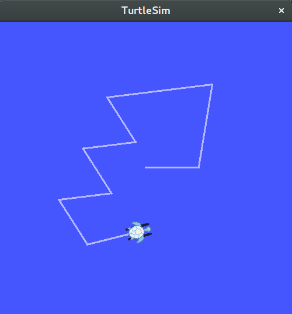
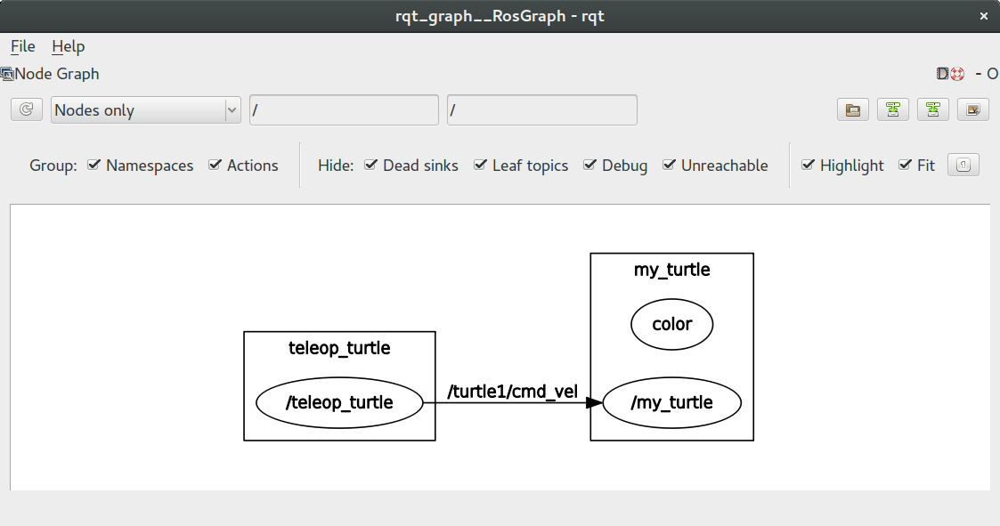
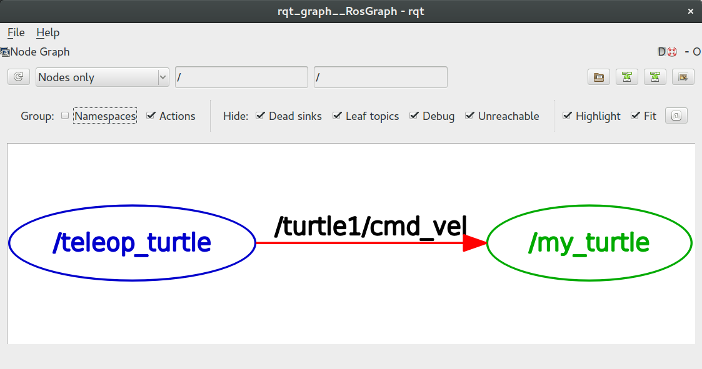
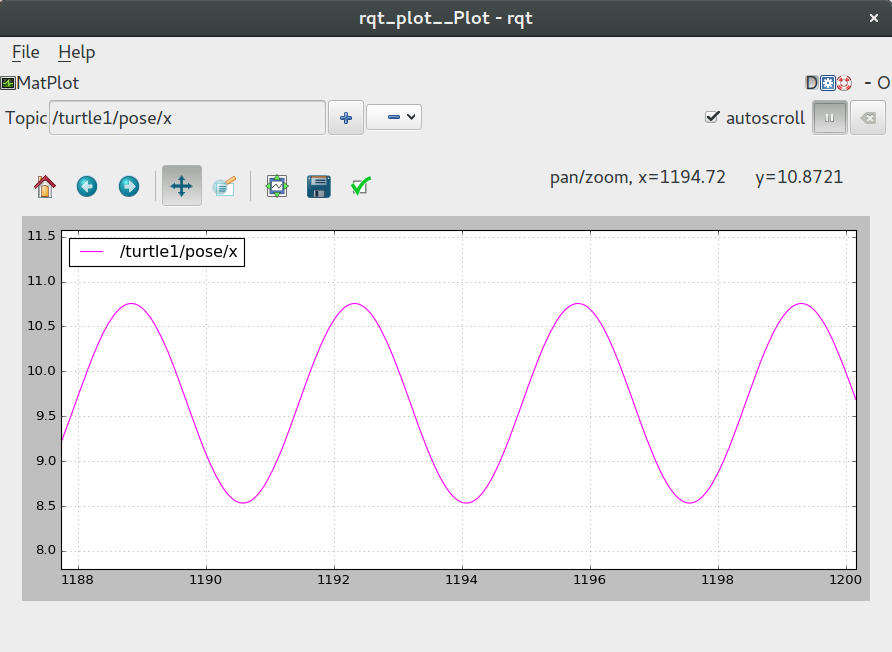
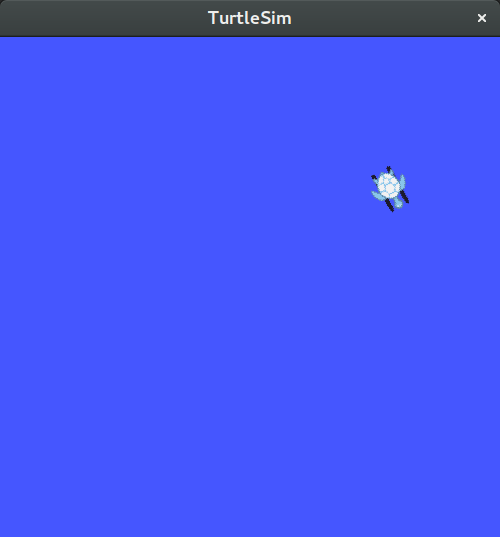

# ROS基础实验

## 1. 实验内容

​    搭建ROS环境，熟悉ROS概念、操作。

 

## 2. ROS简介

​     机器人操作系统 （ Robot Operating System, 简称 ROS），是面向机器人的开源的次级操作系统（ meta-operating system） 。它能够提供类似传统操作系统的诸多功能，如硬件抽象、 底层设备控制、 常用功能实现、 进程间消息传递和程序包管理等。此外，它还提供相关工具和库，用于获取、编译、编辑代码以及在多个计算机之间运行程序完成分布式计算。

 

## 3. ROS环境搭建

### 3.1 操作系统

本实验在操作系统Ubuntu下进行，支持版本为16.04和18.04的ubuntu版本。

### 3.2 ROS安装

​    添加软件源。

```shell
sudo sh -c 'echo "deb http://packages.ros.org/ros/ubuntu $(lsb_release -sc) main" > /etc/apt/sources.list.d/ros-latest.list'
```

​    添加GPG签名验证。

```shell
sudo apt-key adv --keyserver hkp://ha.pool.sks-keyservers.net:80 --recv-key 421C365BD9FF1F717815A3895523BAEEB01FA116
```

​    更新软件包索引。

```shell
sudo apt-get update
```

如果更新软件源报以下错误：

```
W: GPG error: http://packages.ros.org/ros/ubuntu bionic InRelease: The following signatures couldn't be verified because the public key is not available: NO_PUBKEY F42ED6FBAB17C654
E: The repository 'http://packages.ros.org/ros/ubuntu bionic InRelease' is not signed.
N: Updating from such a repository can't be done securely, and is therefore disabled by default.
N: See apt-secure(8) manpage for repository creation and user configuration details.
```

   解决办法：

```
sudo apt-key adv --keyserver keyserver.ubuntu.com --recv-keys F42ED6FBAB17C654
sudo apt-get update
```


   Ros常见版本和对应的ubuntu系统


   安装ROS桌面完整版(根据自己的ubuntu系统进行安装)

```shell
sudo apt-get install ros-kinetic-desktop-full       (ubuntu16.04)
sudo apt-get install ros-melodic-desktop-full       (ubuntu18.04)
```

​    安装过程中若出现如下错误信息：

```
E: Unable to fetch some archives, maybe run apt-get update or try with --fix-missing?
```

​    则按照提示再次更新索引，并继续安装。

```shell
sudo apt-get update
sudo apt-get install ros-kinetic-desktop-full		    (ubuntu16.04)
sudo apt-get install ros-melodic-desktop-full       (ubuntu18.04)
```

​    初次使用ROS需要进行初始化，添加系统依赖，从而支持一些核心组件的运行。

```shell
sudo rosdep init
rosdep update
```

​    设置环境变量。

```shell
安装kinetic版本的执行以下命令
echo "source /opt/ros/kinetic/setup.bash" >> ~/.bashrc
source ~/.bashrc

安装melodic版本的执行以下命令
echo "source /opt/ros/melodic/setup.bash" >> ~/.bashrc
source ~/.bashrc
```

​    对于使用zsh代替bash的用户，需要输入以下命令设置环境变量。

```shell
安装kinetic版本的执行以下命令
echo "source /opt/ros/kinetic/setup.zsh" >> ~/.zshrc
source ~/.zshrc

安装melodic版本的执行以下命令
echo "source /opt/ros/melodic/setup.zsh" >> ~/.zshrc
source ~/.zshrc
```

​    检验环境变量是否设置成功。

```shell
printenv | grep ROS
```

​    环境变量打印信息如下：

```
ROS_ROOT=/opt/ros/kinetic/share/ros
ROS_PACKAGE_PATH=/opt/ros/kinetic/share
ROS_MASTER_URI=http://localhost:11311
ROSLISP_PACKAGE_DIRECTORIES=
ROS_DISTRO=kinetic
ROS_ETC_DIR=/opt/ros/kinetic/etc/ros
```


## 4. ROS文件系统

### 4.1 ROS文件系统概述

​    ROS文件系统中主要有两个重要的概念：Packages和Manifests。

- Packages，是ROS软件代码组织的基本单元。将功能相近的类放在同一个package中，可以方便查找与使用。每一个package包含库文件、可执行文件、脚本文件、或其他工作件。
- Manifests（package.xml），是描述package的文件，用来描述一个package的版本号、维护者、版权许可证等元信息，以及定义packages之间的依赖关系。


### 4.2 ROS文件系统操作

​    ROS提供了一些命令行工具，可以更方便的对ROS文件系统进行操作。

- rosls，直接列出package所在目录文件的内容。

  例如：

  ```shell
  rosls roscpp
  ```

  roscpp所在目录文件内容打印如下：

  ```
  cmake  msg  package.xml  rosbuild  srv
  ```


- roscd，直接切换到package所在目录。

  例如：

  ```
  roscd roscpp
  ```

  输入命令后，切换到了roscpp所在目录。

  输入命令`pwd`可查看当前所在位置，打印信息如下：

  ```
  /opt/ros/kinetic/share/roscpp
  ```

- rosed，直接用vim编辑器编辑package中的一个文件。

  例如：

  ```
  rosed roscpp Logger.msg
  ```

- roscp，直接复制package中的文件，粘贴到指定文件目录。

  例如：command not found

  ```
  roscp roscpp Logger.msg a.msg
  ```

- rospack，获取package的相关信息。

  输入以下命令可以查看`rospack`的使用方法：

  ```
   rospack -h
  ```

  rospack常用功能例如：

  - 查找package所在位置。

    ```
    rospack find roscpp
    ```

    打印信息如下：

    ```
    /opt/ros/kinetic/share/roscpp
    ```

  - 列出package的直接依赖包。

    ```
    rospack depends1 rospy
    ```

    打印信息如下：

    ```
    genpy
    rosgraph
    rosgraph_msgs
    roslib
    std_msgs
    ```

  - 例出package的所有依赖包。

    ```
    rospack depends rospy
    ```

    打印信息如下：

    ```
    catkin
    genmsg
    genpy
    cpp_common
    rostime
    roscpp_traits
    roscpp_serialization
    message_runtime
    gencpp
    geneus
    gennodejs
    genlisp
    message_generation
    rosbuild
    rosconsole
    std_msgs
    rosgraph_msgs
    xmlrpcpp
    roscpp
    rosgraph
    rospack
    roslib
    ```


## 5. ROS系统运行

​    使用ROS系统运行package，可以更方便有效的进行信息传递、节点管理。

### 5.1 ROS graph

​    用图的概念来描述ROS的工作流程。图中关键的元素有：

- Nodes，使用ROS执行的程序，称为节点。
- Messages，发布topic、订阅topic时传送、接收的ROS数据，称为消息。
- Topics，节点以topic为标签发布出去消息，或者订阅某个topic从而接收有这一标签的消息。
- Services，节点提供给其他节点使用的功能服务。
- Master，ROS名字服务器，帮助节点互相定位。
- rosout，ROS系统中的标准输出。
- roscore，Master+rosout+parameter server(后续介绍)

### 5.2 运行roscore

​    使用ROS系统时，首先需要运行roscore。在终端输入以下命令：

```
roscore
```

​    打印信息如下：

```
... logging to /home/youwu/.ros/log/416e84ee-3ef6-11e7-96ab-1866da35b5cb/roslaunch-youwu-OptiPlex-7040-3817.log
Checking log directory for disk usage. This may take awhile.
Press Ctrl-C to interrupt
Done checking log file disk usage. Usage is <1GB.

started roslaunch server http://youwu-OptiPlex-7040:44417/
ros_comm version 1.12.7


SUMMARY
========

PARAMETERS
 * /rosdistro: kinetic
 * /rosversion: 1.12.7

NODES

auto-starting new master
process[master]: started with pid [3829]
ROS_MASTER_URI=http://youwu-OptiPlex-7040:11311/

setting /run_id to 416e84ee-3ef6-11e7-96ab-1866da35b5cb
process[rosout-1]: started with pid [3842]
started core service [/rosout]
```

​    终端会一直运行roscore，使用`Ctrl-C`停止运行。

​    也可运行以下命令，使roscore在后台运行。

```shell
roscore&
```

​     终端上会打印出roscore的进程pid。不同进程的pid不同。

```
[1] 3919
```

​    此外，可使用以下命令查询roscore的pid。

```shell
ps | grep roscore
```

​    若想要停止后台运行的roscore，使用kill命令，参数为roscore的pid。例如：

```
kill 3919
```

​    ROS系统需要运行一个roscore，但一台计算机上只能运行一个roscore。若已经运行了一个roscore，再新建终端运行roscore时会打印以下错误信息。

```
roscore cannot run as another roscore/master is already running. 
Please kill other roscore/master processes before relaunching.
```

​    确认当前已经运行一个roscore。

​    在终端中输入以下命令，列出正在运行的节点。

```
rosnode list
```

​    打印信息如下：

```
/rosout
```

​    可见，运行roscore时，会自动运行rosout，用以收集、记录节点的调试信息。

​    输入以下命令，查看rosout节点的详细信息。

```
rosnode info /rosout
```

​    打印信息如下：

```
--------------------------------------------------------------------------------
Node [/rosout]
Publications: 
 * /rosout_agg [rosgraph_msgs/Log]

Subscriptions: 
 * /rosout [unknown type]

Services: 
 * /rosout/set_logger_level
 * /rosout/get_loggers


contacting node http://youwu-OptiPlex-7040:38553/ ...
Pid: 3943
```

​    打印的信息表明，rosout节点发布topic：rosout_agg，传送消息的类型为rosgraph_msgs/Log，订阅topic：rosout，接收消息的类型为unknown type。rosout提供服务/rosout/set_logger_level、/rosout/get_loggers。rosout的进程pid为3943。

### 5.3 运行node 

​    运行roscore之后，就可以运行节点实现用户功能。

​    使用rosrun命令运行节点。rosrun命令格式为：

```
rosrun [package_name] [node_name]
```

​    ROS会定位名为package_name的package，在package中查找名为node_name的可执行文件，若找到，则运行。

​    以一个仿真小乌龟的程序为例：

```
rosrun turtlesim turtlesim_node
```

​    会弹出以下窗口，如图1所示：


​										图 1 仿真小乌龟

​    每次运行小乌龟的形状是不一样的。

​    新建终端，输入以下命令查看当前运行的ros节点。

```
rosnode list
```

​    打印信息如下：

```
/rosout
/turtlesim
```

​    关闭窗口结束turtlesim节点的运行。

​    输入命令查看节点是否已经停止。

```
rosnode list
```

​    打印信息如下：

```
/rosout
```

​    若使用`Ctrl-C`停止turtlesim节点程序，查看当前运行节点会发现节点并没有停止。

```
rosnode list
```

​    打印信息如下：

```
/rosout
/turtlesim
```

​    这时可以输入以下命令，清空实际已经停止的节点程序。

```
rosnode cleanup
```

​    输入命令后，会打印信息向用户确认是否清空，输入`y`。

​    之后再重新查看当前运行节点，可以发现turtlesim节点已经停止。

​    在ROS中，节点有默认的名字，也可通过以下方式自定义节点名称。

```
rosrun turtlesim turtlesim_node __name:=my_turtle
```

​    查看当前运行节点。

```
rosnode list
```

​    打印信息如下：

```
/my_turtle
/rosout
```

​    ROS不允许运行相同名字的节点。若已运行某个名字的节点，再次运行这个名字的节点，会强制停止运行之前的节点。通过自定义节点的名字，可以实现同一个package的可执行文件运行多次。

  

## 6 ROS 信息传输

​    ROS系统最重要的特点之一在于简洁、高效的进程进通信机制。多个ROS节点之间，可以通过发布、订阅topic来传送、接收信息。

### 6.1 运行多个节点

​    接着上一个实验，已经运行了一个roscore，并且运行了小乌龟仿真程序turtlesim_node，即当前运行节点为：

```
/my_turtle
/rosout
```

​    新建终端，运行turtle_teleop_key，实现通过方向键控制小乌龟运动。

```
rosrun turtlesim turtle_teleop_key
```

​    调整该终端与之前仿真小乌龟的窗口的位置，使终端不会遮挡仿真小乌龟的窗口。

​    鼠标点击运行turtle_teleop_key的终端，将其作为当前活动窗口，从而正确接收键盘按键。通过方向键控制小乌龟运动：上，小乌龟超前运动；下，小乌龟向后运动；左，小乌龟左转；右，小乌龟右转。

​     小乌龟运动后在界面上会留下运动轨迹，如图2所示：


​										图 2 小乌龟运动轨迹

​    输入命令查看一下当前运行的节点。

```
rosnode list
```

   打印信息如下：

```
/my_turtle
/rosout
/teleop_turtle
```

### 6.2 ROS Topics

​    使用方向键控制小乌龟运动，是通过my_turtle和teleop_turtle的进程间通信实现的。teleop_turtle节点接收方向键，并发布topic，将键值作为消息发送出去；my_turtle订阅这个topic，接收该topic的所有消息，获取键值，根据不同键值，控制小乌龟作不同的运动。

#### 6.2.1 rqt_graph

​    ROS提供了一个工具rqt_graph，可以将进程间的通信以图形的方式呈现出来。

​    新建终端，输入以下命令，调用rqt_graph。

```
rosrun rqt_graph rqt_graph
```

​    弹出如图3所示窗口：


​										图 3 rqt_graph图形化工具

​    可以省略Namespaces进一步简化图形。在工具栏取消选择Namespaces的显示。简化后的进程间通信图形如图4所示。


​										图 4 简化后进程间通信图形

​    在图4中可以看到用椭圆框表示的节点/teleop_turtle和/my_turtle。/teleop_turtle用箭头指向/my_turtle，表示两个节点间有信息通信。箭头上方的字符表示topic名称，即/teleop_turtle和/my_turtle之间通过/turtle1/cmd_vel进行通信。箭头出发点表示topic的发布方，箭头指向点表示topic的订阅方。

​    将鼠标移至/turtle1/cmd_vel字符上方，rqt_graph会将topic用红色高亮，topic发布方用蓝色高亮，topic订阅方用绿色高亮。

​    rqt_graph其实是作为一个ROS节点运行的，查看当前运行节点可以看到rqt_graph节点。

```
rosnode list
```

​    打印信息如下：

```
/my_turtle
/rosout
/rqt_gui_py_node_4792
/teleop_turtle
```

#### 6.2.2 rostopic list

​    除了图形化显示工具rqt_graph，ROS也提供了一个命令行工具rostopic，供用户对Topic进行操作。

​    新建终端，输入以下命令查看rostopic的用法。

```
rostopic -h
```

​    打印信息如下：

```
rostopic is a command-line tool for printing information about ROS Topics.

Commands:
	rostopic bw	display bandwidth used by topic
	rostopic delay	display delay of topic from timestamp in header
	rostopic echo	print messages to screen
	rostopic find	find topics by type
	rostopic hz	display publishing rate of topic    
	rostopic info	print information about active topic
	rostopic list	list active topics
	rostopic pub	publish data to topic
	rostopic type	print topic or field type

Type rostopic <command> -h for more detailed usage, e.g. 'rostopic echo -h'
```

​     rostopic包含9个子命令，可以使用`rostopic <command> -h`查询子命令的用法。

​     从rostopic的子命令介绍中可以看出，`rostopic list`可以显示活动的topics。

​     终端输入以下命令：

```
rostopic list -v
```

​     打印信息如下：

```
Published topics:
 * /turtle1/color_sensor [turtlesim/Color] 1 publisher
 * /turtle1/cmd_vel [geometry_msgs/Twist] 1 publisher
 * /rosout [rosgraph_msgs/Log] 3 publishers
 * /rosout_agg [rosgraph_msgs/Log] 1 publisher
 * /turtle1/pose [turtlesim/Pose] 1 publisher

Subscribed topics:
 * /turtle1/cmd_vel [geometry_msgs/Twist] 1 subscriber
 * /rosout [rosgraph_msgs/Log] 1 subscriber
 * /statistics [rosgraph_msgs/TopicStatistics] 1 subscriber
```

​     从打印信息中可以看出，当前ROS系统中一共有5个topic，但是在rqt_graph中只显示了一个topic。

​     这是因为rqt_graph在呈现ROS系统节点间的信息通信时，忽略了自身和rosout两个节点，同时只有当topic的发布方、订阅方都存在的时候才会显示。例如/my_turtle发布了topic "/turtle1/pose"，传递小乌龟的位置信息，但该topic没有订阅方，所以在rqt_graph里没有显示。

### 6.3 ROS Messages

​    在ROS系统中，通过发布、订阅topic建立节点之间的通信关系，而真正传递信息的是message。

​    在ROS中，用message的类型定义topic的类型。

#### 6.3.1 rostopic type

​    使用` rostopic type`可以查看topic的类型。新建终端输入以下命令：

```
rostopic type /turtle1/cmd_vel
```

​    打印信息如下：

```
geometry_msgs/Twist
```

​    /turtle1/cmd_vel的消息类型是geometry_msgs/Twist。可以输入以下指令进一步查看消息具体类型信息：

```
rosmsg show geometry_msgs/Twist
```

​    打印信息如下：

```
geometry_msgs/Vector3 linear
  float64 x
  float64 y
  float64 z
geometry_msgs/Vector3 angular
  float64 x
  float64 y
  float64 z
```

​    geometry_msgs/Twist消息中包含线速度、角速度信息，线速度、角速度分别包含x、y、z轴的分量。

​    可以将上两条命令合并为一条命令。

```shell
rostopic type /turtle1/cmd_vel | rosmsg show
```

#### 6.3.2 rostopic echo

​    使用` rostopic echo`可以将每次消息的内容打印出来。

​    在终端中输入以下命令：

```
rostopic echo /turtle1/cmd_vel
```

​    终端将等待接收message，若发布了新的message，则将其打印出来。

​    切换到turtle_teleop_key终端，按下方向键，rostopic echo终端中会打印出message的内容。

​    若在turtle_teleop_key终端按下"上"键，则rostopic echo终端打印信息如下：

```
linear: 
  x: 2.0
  y: 0.0
  z: 0.0
angular: 
  x: 0.0
  y: 0.0
  z: 0.0
---
```

​    rostopic echo作为一个ROS节点运行。新建终端输入以下命令查看当前运行的节点：

```
rosnode list
```

​    打印信息如下：

```
/my_turtle
/rosout
/rostopic_5023_1495610639924
/rqt_gui_py_node_4792
/teleop_turtle
```

​    在rqt_graph图形化工具中可以看到当前ROS系统的信息通信。在之前实验打开的rqt_graph界面中，点击刷新，则得到当前ROS系统信息通信结构，如图所示。


​										图 5 ROS系统信息通信结构

​    从图5中可以看出，rostopic echo打印/turtle1/cmd_vel的消息的原理是订阅/turtle1/cmd_vel，接收其消息，再将其打印出来。

- /teleop_turtle发布topic "/turtle1/cmd_vel"。
- /my_turtle和/rostopic\_5023\_1495610639924订阅topic "/turtle1/cmd_vel"。
  - /my_turtle接收/turtle1/cmd_vel的messages，解析之后控制小乌龟动。 
  - /rostopic\_5023\_1495610639924接收/turtle1/cmd_vel的messages，直接打印到终端上。

#### 6.3.3 rostopic pub

​    使用`rostopic pub`可以发布一个topic的消息。

​    新建输入以下命令：

```
rostopic pub -1 /turtle1/cmd_vel geometry_msgs/Twist -- '[2.0, 0.0, 0.0]' '[0.0, 0.0, 1.8]'
```

​    消息的topic为"/turtle1/cmd_vel"，消息的类型为"geometry_msgs/Twist"，消息的内容为" '[2.0, 0.0, 0.0]' '[0.0, 0.0, 1.8]' "，"-1"表示"rostopic pub"节点发送一次信息之后就停止，"--"表示分隔符，分隔符之后的参数均为消息的值。

​    发布消息之后，可以在仿真小乌龟的窗口观察到小乌龟的运动轨迹，如图6所示。


​											图 6 小乌龟运动轨迹

​    由于只发送了一次消息，所以小乌龟移动一次之后便停止运动。输入以下命令以1Hz的频率循环发布消息。

```
rostopic pub /turtle1/cmd_vel geometry_msgs/Twist -r 1 -- '[2.0, 0.0, 0.0]' '[0.0, 0.0, -1.8]'
```

​    其中，"-r"表示循环发布，"1"表示以1Hz的频率周期发送。

​    可以观察到，小乌龟做匀速圆周运动，如图7所示。


​										图 7 小乌龟匀速圆周运动

​    使用rqt_graph查看节点之间的信息通信结构。在rqt_graph界面中，点击刷新，得到如图8所示图形。

      																		
​										图 8 ROS系统信息通信结构

​    /rostopic\_6354\_1495613313883是rostopic pub节点，发布topic "/turtle1/cmd_vel"。

​    节点订阅topic时，只匹配topic的名字和类型，不关心topic的发布者。例如实验中，/my_turtle和 /rostopic\_5023\_1495610639924节点订阅geometry_msgs/Twist类型的topic "/turtle1/cmd_vel"，来自/teleop_turtle和 /rostopic\_6354\_1495613313883的topic "/turtle1/cmd_vel"都会接收。

#### 6.3.4 rostopic hz

​    使用`rostopic hz`可以查看一个topic的message发布频率。

​    输入以下命令：

```
rostopic hz /turtle1/cmd_vel
```

​     打印信息如下：

```
ubscribed to [/turtle1/cmd_vel]
no new messages
average rate: 1.000
	min: 1.000s max: 1.000s std dev: 0.00000s window: 2
average rate: 1.000
	min: 0.999s max: 1.000s std dev: 0.00048s window: 3
average rate: 1.000
	min: 0.999s max: 1.001s std dev: 0.00058s window: 4
...
```

​    若只发送一次message，该message不检测频率。

#### 6.3.5 rqt_plot 

​    ROS提供了一个可以将message的值绘制成图形的工具，rqt_plot。

​    新建终端，输入以下命令：

```
rosrun rqt_plot rqt_plot
```

​    弹出如图所示窗口。


​											图 9 rqt_plot工具

​    在界面的Topic输入栏输入/turtle1/pose，按回车键，rqt_plot会将/turtle1/pose所有变量的变化用曲线表示出来，如图10所示。


​									图 10 导入topic "/turtle1/pose"

​    点击界面中的“减号”，可以将不需要显示的曲线去掉。点击“移动”符号之后，鼠标左键可以移动竖轴显示区域，鼠标右键可以放大缩小显示区域。/turtle1/pose/x的变化曲线如图11所示：


​									图11  /turtle1/pose/x变化曲线

### 6.4关闭终端

​    关闭不需要的终端，保持界面的整洁。

​    关闭turtle_teleop_key、rqt_graph、rostopic等终端，仅保持roscore、/my_turtle的运行。

​    新建终端输入以下命令查看当前运行的节点。

```
rosnode list
```

​    打印信息如下：

```
/my_turtle
/rosout
```

​    当前仿真小乌龟的界面如图12所示：


​										图 12 当前仿真小乌龟界面


## 7 ROS 服务

​    节点之间除了通过发布、订阅topic的方式，还可以通过服务的方式进行交互。ROS服务机制允许节点提交服务请求（request）并接收服务响应（response）。

​    ROS提供了一个命令行工具rosservice，让用户可以方便的与ROS客户/服务框架进行交互。

​    输入以下命令。查看rosservice的用法。

```
rosservice -h
```

​    打印信息如下：

```
Commands:
	rosservice args	print service arguments
	rosservice call	call the service with the provided args
	rosservice find	find services by service type
	rosservice info	print information about service
	rosservice list	list active services
	rosservice type	print service type
	rosservice uri	print service ROSRPC uri

Type rosservice <command> -h for more detailed usage, e.g. 'rosservice call -h'
```

### 7.1 rosservice list

​    使用`rosservice list`可以列出当前ROS系统各节点提供的服务。

​    终端输入以下命令：

```
rosservice list
```

​    打印信息如下：

```
/clear
/kill
/my_turtle/get_loggers
/my_turtle/set_logger_level
/reset
/rosout/get_loggers
/rosout/set_logger_level
/spawn
/turtle1/set_pen
/turtle1/teleport_absolute
/turtle1/teleport_relative
```

​    从打印结果中无法看出，每个服务由哪个节点提供。可以添加命令参数，列出服务的同时说明每个服务的提供者。

```
rosservice list -n
```

​    打印信息如下：

```
/clear /my_turtle
/kill /my_turtle
/my_turtle/get_loggers /my_turtle
/my_turtle/set_logger_level /my_turtle
/reset /my_turtle
/rosout/get_loggers /rosout
/rosout/set_logger_level /rosout
/spawn /my_turtle
/turtle1/set_pen /my_turtle
/turtle1/teleport_absolute /my_turtle
/turtle1/teleport_relative /my_turtle
```

​    打印结果较为凌乱。若查看某个节点所提供的服务，建议使用rosnode命令。

```
rosnode info /my_turtle
```

​    部分打印信息如下：

```
--------------------------------------------------------------------------------
Node [/my_turtle]
...
Services: 
 * /turtle1/teleport_absolute
 * /my_turtle/get_loggers
 * /my_turtle/set_logger_level
 * /reset
 * /spawn
 * /clear
 * /turtle1/set_pen
 * /turtle1/teleport_relative
 * /kill
...
```

### 7.2 rosservice type

​    使用`rosservice type`可以查看service的类型。

​    终端输入以下命令：

```
rosservice type /clear
```

​    打印信息如下：

```
std_srvs/Empty
```

​    进一步查看服务的具体类型。

```
rossrv show std_srvs/Empty
```

​    打印信息如下：

```
---
```

​    说明`std_srvs/Empty`类型的服务，不需要参数，也没有返回值。因此，如果调用/clear服务，不需要提供参数，也不需要接收返回值。

​    以上两条命令可以合并为一条命令：

```
rosservice type /clear | rossrv show
```

### 7.3 rosservice call

​    使用`rosservice call`可以从终端调用节点提供的服务。

​    命令格式如下：

```
rosservice call [service] [args]
```

​    例如，调用/clear，清除小乌龟运动轨迹服务。

```
rosservice call /clear
```

​    当前仿真小乌龟界面如图13所示。



​    										图 13 清除小乌龟运动轨迹

​    调用/clear不需要参数也没有返回值。

​    下面，以/spawn服务说明，需要参数的调用方法，以及获取其返回值。

​    /spawn服务实现了在仿真小乌龟的窗口上再创建一个小乌龟的功能。

​    首先查看服务的类型。

```
rosservice type /spawn | rossrv show
```

​    打印信息如下：

```
float32 x
float32 y
float32 theta
string name
---
string name
```

​    也可以查看Spawn的服务声明文件Spawn.srv。

```
roscd turtlesim
cat srv/Spawn.srv
```

​    打印信息如下：

```
float32 x
float32 y
float32 theta
string name # Optional.  A unique name will be created and returned if this is empty
---
string name
```

​    由/spawn服务类型可知，服务需要三个参数，新小乌龟的位置x、y，小乌龟的朝向theta。name参数是可选参数，若为空，则程序为新小乌龟分配一个名字，并将其返回出来。

​    调用/spawn服务。

```
rosservice call /spawn 2 2 0.2 ""
```

​    打印信息如下：

```
name: turtle2
```

​    在仿真小乌龟的界面上可以看到新的小乌龟，如图14所示。


​											图 14 新建小乌龟

 

## 8 ROS 节点参数

​    节点实现功能的时候通常会涉及某个参数。例如仿真小乌龟中的背景参数为蓝色，在渲染界面时就会将界面背景填充为蓝色。在节点的一次执行中，这类参数通常是保持不变的。

​    ROS将这类参数参数存在parameter server中。Parameter server是一个共享的、多层字典的数据结构。节点可以在运行期从parameter server提取参数或者存储参数。

​    使用命令行工具rosparam可以对ROS parameter server进行操作。

​    输入以下命令查看rosparam的用法。

```
rosparam -h
```

​    打印信息如下：

```
rosparam is a command-line tool for getting, setting, and deleting parameters from the ROS Parameter Server.

Commands:
	rosparam set	set parameter
	rosparam get	get parameter
	rosparam load	load parameters from file
	rosparam dump	dump parameters to file
	rosparam delete	delete parameter
	rosparam list	list parameter names
```

### 8.1 rosparam list

​     使用`rosparam list`可以列出当前Parameter server中的参数。

​     输入以下命令：

```
rosparam list
```

​     打印信息如下：

```
/background_b
/background_g
/background_r
/rosdistro
/roslaunch/uris/host_youwu_optiplex_7040__35245
/rosversion
/run_id
```

​    决定界面背景的是三个参数/background_b、/background_g、/background_r，在BGR颜色空间取色。

### 8.2 rosparam get

​    使用`rosparam get`可以提取当前Parameter server中参数的值。

​    输入以下命令：

```
rosparam get /background_g 
```

​    打印信息如下：

```
86
```

​    Parameter server中采用命名的树状目录存储参数。树上每一个节点都是字典，键是参数的名字，值是参数的值。根节点`/`的字典中存储所有的参数，若参数的值本身也是一个字典，则参数树进一步往下延伸。

​    输入以下命令查看所有参数的值：

```
rosparam get /
```

​    打印信息如下：

```
background_b: 255
background_g: 86
background_r: 69
rosdistro: 'kinetic

  '
roslaunch:
  uris: {host_youwu_optiplex_7040__35245: 'http://youwu-OptiPlex-7040:35245/'}
rosversion: '1.12.7

  '
run_id: 5b0d2d7e-40f9-11e7-bc63-1866da35b5cb
```

### 8.3 rosparam set

​    使用`rosparam set`可以修改parameter server中参数的值。

​    输入以下命令，将界面背景设为浅灰色。

```
rosparam set /background_b 200
rosparam set /background_g 200
rosparam set /background_r 200
```

​    调用/clear服务，根据颜色参数重新填充背景。

```
rosservice call /clear
```

​    仿真小乌龟界面背景填充为浅灰色，如图所示。


​									图 15 设置界面背景为浅灰色

### 8.4 rosparam dump

​    使用`rosparam dump`可以将parameter server中的参数存入文件。

​    命令格式如下：

```
rosparam dump [file_name] [namespace]
```

​    namespace为空，则默认存储`/`。

​    将parameter server中所有参数params.yaml文件。

```
rosparam dump params.yaml
```

​    查看params.yaml文件内容。

```shell
cat params.yaml
```

​    文件内容如下：

```
background_b: 200
background_g: 200
background_r: 200
rosdistro: 'kinetic

  '
roslaunch:
  uris: {host_youwu_optiplex_7040__35245: 'http://youwu-OptiPlex-7040:35245/'}
rosversion: '1.12.7

  '
run_id: 5b0d2d7e-40f9-11e7-bc63-1866da35b5cb
```

### 8.5 rosparam load

​    使用`rosparam load`可以将文件中的参数导入parameter server。

​    命令格式如下：

```
rosparam load [file_name] [namespace]
```

​    namespace为空，则默认值为`/`。

​    修改之前保存参数的文件params.yaml，使参数值与之前不同，可以将未修改的参数删除，也可添加新的参数。

```
vi params.yaml
```

​    修改之后的params.yaml内容如下：

```
background_b: 100
background_g: 100
background_r: 100
hello： 1
```

​    将params.yaml文件中的参数导入parameter server，修改`/`树下的参数值。

```
rosparam load params.yaml
```

​    查看当前系统的参数。

```
rosparam get /
```

​    打印信息如下：

```
background_b: 100
background_g: 100
background_r: 100
hello: 1
rosdistro: 'kinetic

  '
roslaunch:
  uris: {host_youwu_optiplex_7040__35245: 'http://youwu-OptiPlex-7040:35245/'}
rosversion: '1.12.7

  '
run_id: 5b0d2d7e-40f9-11e7-bc63-1866da35b5cb
```

​    background_b、background_g、background_r三个参数的值发生变化，新添了参数hello，其余的参数保持不变。

  

## 9 ROS工作空间

​    ROS采用catkin workspace作为其工作空间。catkin是ROS的编译系统，将源代码编译为终端可执行的目标程序。在catkin workspace中编写代码，有利于提高项目开发的效率、提高项目的可管理性。

​    首先创建工作区根目录、源代码目录。

```shell
mkdir -p ~/catkin_ws/src
```

​    切换到工作区根目录，使用catkin_make编译。

```shell
cd ~/catkin_ws/
catkin_make
```

​    编译之后，在空的工作区中生成了一些目录、文件。可以使用tree命令查看工作区文件结构。

```shell
tree
```

​    创建工作区之后，需要配置环境变量让ROS知道工作区的位置。可以执行工作区编译之后生成的脚本文件方便的修改环境变量。

```shell
echo "source /home/youwu/catkin_ws/devel/setup.bash" >> ~/.bashrc
source ~/.bashrc
```

​    其中/home/youwu/catkin_ws为工作区所在路径。

​    若只需对当前终端有效，可直接执行shell程序文件修改环境变量。

```shell
source devel/setup.bash
```

​    查看环境变量，检测是否配置成功。

```shell
echo $ROS_PACKAGE_PATH
```

​    环境变量打印信息如下：

```
/home/youwu/catkin_ws/src:/opt/ros/kinetic/share
```

​     

## 10 ROS Package

### 10.1 catkin package

​    与ROS workspace一致，ROS package也采用catkin格式的包。

​    catkin package有三个格式要求：

- Package中必须含有一个遵循catkin编译格式的package.xml文件，用来描述package的元信息。
- Package中必须含有一个遵循catkin编译格式的CMakelist.txt文件。
- 同一个package目录下只允许存在一个catkin package。

​    一个最简单的catkin package包含一个package.xml文件和一个CMakelist.txt文件。

​    编写的catkin packages存放于catkin workspace中。一个可行的catkin workspace通常有如图16所示的文件目录结构：


​									图 16 catkin workspace文件目录结构

### 10.2 创建package

​    ROS提供了一个命令行工具catkin_create_pkg，可以方便的创建catkin package。

​    输入以下命令查看catkin_create_pkg的用法：

```
catkin_create_pkg -h
```

​    常用的catkin_create_pkg命令格式如下：

```
catkin_create_pkg <package_name> [depend1] [depend2] [depend3]
```

​    package_name是即将创建的package名字，depend1、depend2等等是package需要的依赖包。

​    输入以下命令创建catkin package：beginner_tutorials，其直接依赖包为std_msgs、rospy、roscpp。std_msgs是标准信息包，rospy、roscpp是客户库包，允许用不同语言编写的package之间可以相互传递数据。

```shell
cd ~/catkin_ws/src
catkin_create_pkg beginner_tutorials std_msgs rospy roscpp
```

​    查看生成的package目录。

```
tree beginner_tutorials
```

​    打印信息如下：

```
beginner_tutorials
├── CMakeLists.txt
├── include
│   └── beginner_tutorials
├── package.xml
└── src

3 directories, 2 files
```

​    从打印信息中可以看出，catkin_create_pkg命令创建了3个目录、2个文件。

​    package.xml文件中包含了package的描述、维护者、软件许可证、依赖等元信息，可以保持默认，也可以根据实际需要进行修改。

​    编译系统根据CMakeList.txt进行编译，暂时无需修改。

### 10.3 编译package

​    创建package之后需要进行编译操作，切换到catkin workspace根目录使用catkin_make进行编译。

```shell
cd ~/catkin_ws/
catkin_make
```

​    编译生成的文件会储存在catkin_ws/build目录下对应package名字的目录中。


## 11 ROS功能文件

​    通过给package添加各功能文件，使package实现各种功能。

### 11.1 Launch文件

​    通过编写launch引导文件，可以让ROS按照文件中描述的方式运行节点。

​    功能文件通常存放于功能目录中。

​    在beginner_tutorials中新建launch目录，在launch目录中新建turtlemimic.launch文件。

```shell
roscd beginner_tutorials
mkdir launch
cd launch
touch turtlemimic.launch
```

​    填写touch turtlemimic.launch文件。文件内容如下：

```xml
<launch>

  <group ns="turtlesim1">
    <node pkg="turtlesim" name="sim" type="turtlesim_node"/>
  </group>

  <group ns="turtlesim2">
    <node pkg="turtlesim" name="sim" type="turtlesim_node"/>
  </group>

  <node pkg="turtlesim" name="mimic" type="mimic">
    <remap from="input" to="turtlesim1/turtle1"/>
    <remap from="output" to="turtlesim2/turtle1"/>
  </node>

</launch>
```

   文件中定义了"turtlesim1"、"turtlesim2"两个group的命名空间，防止出现命名冲突。每个group中定义了一个节点，节点执行package "turtlesim"中的可执行程序"turtlesim_node"，节点命名为"sim"。

​    group之外定义了一个节点，节点执行package "turtlesim"中的可执行程序"mimic"，节点命名为"mimic"。重新映射节点的输入、输出，将"turtlesim1/turtle1"作为输入，"turtlesim2/turtle1"作为输出。

​    使用命令行工具roslaunch执行launch文件。

```
roslaunch beginner_tutorials turtlemimic.launch
```

​    弹出两个仿真小乌龟的窗口。

​    给小乌龟1发送运动指令，让小乌龟1作匀速圆周运动。新建终端，输入以下命令：

```
rostopic pub /turtlesim1/turtle1/cmd_vel geometry_msgs/Twist -r 1 -- '[2.0, 0.0, 0.0]' '[0.0, 0.0, -1.8]'
```

​    小乌龟1作圆周运动，小乌龟2会模仿小乌龟1作相同的动作。如图17所示：


​										图 17 小乌龟2模仿小乌龟1

​    使用rqt_graph查看当前ROS系统各节点之间的通信关系。新建终端，输入以下命令：

```
rqt_graph
```

​    当前各节点通信关系如图18所示：


​										图 18 ROS系统节点通信

​    ROS系统当前的信息通信为：

- /rostopic\_6281\_1495782804493节点发布/turtlesim1/turtle1/cmd_vel小乌龟1运动指令。
- 小乌龟1节点订阅运动指令进行运动，并发布当前位置信息turtlesim1/turtle1/pose。
- /mimic节点订阅小乌龟1的位置信息，计算之后发布turtlesim2/turtle1/cmd_vel小乌龟2运动指令。
- 小乌龟2节点订阅运动指令进行运动。

### 11.2 Msg文件

​    节点之间通过messages进行通信。

#### 11.2.1 消息类型

​    节点发布、接收消息之前需要先定义消息的类型。消息类型定义写在msg文件中。

​    在beginner_tutorials中建立msg目录，在目录中新建Hello.msg文件。

```shell
roscd beginner_tutorials
mkdir msg
touch Hello.msg
```

​    在Hello.msg文件中定义message类型。文件内容如下：

```
Header header
int64 num
string greeting
```

​    Message "Hello"中包含三个变量，Header变量header，16位int整形变量num，字符串变量greeting。Header是ROS系统定义的一种数据类型，包含了时间戳、消息源等常用ROS系统信息。

​    使用rosmsg检验能否正确识别Hello.msg。

```
rosmsg show beginner_tutorials/Hello
```

​    打印信息如下：

```
std_msgs/Header header
  uint32 seq
  time stamp
  string frame_id
int64 num
string greeting
```

#### 11.2.2 编译

​    节点发布、接收消息需要添加两种依赖库：编译时需要"message_generation"，运行时需要"message_runtime"。

​    打开package.xml文件。

```
rosed beginner_tutorials package.xml
```

​    在文件中添加依赖关系描述。

```xml
  <build_depend>message_generation</build_depend>
  <exec_depend>message_runtime</exec_depend>
```

​    CMakeList.txt也需要作相应修改。

```
rosed beginner_tutorials CMakeLists.txt
```

​    在文件中找到如下find_package调用。

```cmake
find_package(catkin REQUIRED COMPONENTS
  roscpp
  rospy
  std_msgs
)
```

​    在COMPONENTS列表中添加message_generation编译依赖库。修改之后的find_package如下：

```cmake
find_package(catkin REQUIRED COMPONENTS
   roscpp
   rospy
   std_msgs
   message_generation
)
```

​    在文件中找到catkin_package调用。

```cmake
catkin_package(
#  INCLUDE_DIRS include
#  LIBRARIES beginner_tutorials
#  CATKIN_DEPENDS roscpp rospy std_msgs
#  DEPENDS system_lib
)
```

​    将CATKIN_DEPENDS这一行取消注释，并添加message_run运行依赖库。修改之后的catkin_package如下：

```cmake
catkin_package(
#  INCLUDE_DIRS include
#  LIBRARIES beginner_tutorials
   CATKIN_DEPENDS roscpp rospy std_msgs message_runtime
#  DEPENDS system_lib
)
```

​    添加完依赖库之后，还需导入msg文件。

​    在文件中找到add_message_files调用。

```cmake
# add_message_files(
#   FILES
#   Message1.msg
#   Message2.msg
# )
```

​    取消对add_message_files的注释，并在FILES列表中添加之前创建的Hello.msg。修改之后的add_message_files如下：

```cmake
add_message_files(
  FILES
  Hello.msg
)
```

​    最后在文件中找到generate_messages调用。

```cmake
# generate_messages(
#   DEPENDENCIES
#   std_msgs
# )
```

​    取消其注释。

```cmake
generate_messages(
  DEPENDENCIES
  std_msgs
)
```

​    切换到catkin workspace根目录，使用catkin_make编译，检验message是否创建正确。

```shell
cd ~/catkin_ws
catkin_make
catkin_make install
```

​    catkin_make install后，在工作区catkin_ws/include/beginner_tutorials目录中创建了Hello.h。

### 11.3 Srv文件

​    节点可以提供供其他节点使用的服务。

#### 11.3.1 服务原型

​    服务的原型定义在msg文件中。

​    在beginner_tutorials中建立srv目录，在目录中新建AddTwoInts.srv文件。

```shell
roscd beginner_tutorials
mkdir srv | cd srv
touch AddTwoInts.srv
```

​    AddTwoInts.srv文件内容如下：

```
int64 a
int64 b
---
int64 sum
```

​    分隔符上方是AddTwoInts服务所需要的参数，分隔符下方是AddTwoInts服务的返回值。AddTwoInts需要两个64位整形的参数，返回一个64位整形的参数。

​    使用rossrv检验ROS系统能否识别AddTwoInts服务。

```
rossrv show beginner_tutorials/AddTwoInts
```

   打印信息如下：

```
int64 a
int64 b
---
int64 sum
```

#### 11.3.2 编译

​     节点使用、提供服务同样需要添加依赖，依赖库与消息依赖库一样：编译时需要"message_runtime"，运行时需要"message_runtime"。

​    打开package.xml文件。

```
rosed beginner_tutorials package.xml
```

​     检验package.xml文件中是否有以下依赖描述。

```xml
  <build_depend>message_generation</build_depend>
  <run_depend>message_runtime</run_depend>
```

​    打开CMakeLists.txt文件。

```
rosed beginner_tutorials CMakeLists.txt
```

​    检验CMakeLists.txt文件中是否添加依赖库：

```cmake
find_package(catkin REQUIRED COMPONENTS
  roscpp
  rospy
  std_msgs
  message_generation
)
```

```cmake
catkin_package(
#  INCLUDE_DIRS include
#  LIBRARIES beginner_tutorials
   CATKIN_DEPENDS roscpp rospy std_msgs message_run
#  DEPENDS system_lib
)
```

```cmake
generate_messages(
  DEPENDENCIES
  std_msgs
)
```

​    添加依赖库后，还需导入srv文件。

​    在CMakeLists.txt文件找到add_service_files调用：

```cmake
# add_action_files(
#   FILES
#   Action1.action
#   Action2.action
# )
```

​    取消其注释，并在FILES列表中加入AddTwoInts.srv。修改后的add_service_files如下：

```cmake
add_service_files(
  FILES
  AddTwoInts.srv
)
```

​    切换到catkin workspace根目录，使用catkin_make编译，检验service是否创建正确。

```shell
cd ~/catkin_ws
catkin_make
catkin_make install
```

​    catkin_make install后，在工作区catkin_ws/include/beginner_tutorials目录中创建了AddTwoInts.h、AddTwoIntsRequest.h 、AddTwoIntsResponse.h。


## 12 ROS发布者、订阅者

​    定义了msg类型之后，需要编写程序实现发布、订阅topic的功能。

### 12.1 发布者

​    切换到beginner_tutorials目录，建立src目录。

```shell
roscd beginner_tutorials
mkdir -p src
```

​    发布者Publisher也称为talker。在src目录中建立talker.cpp文件。

```shell
cd src
touch talker.cpp
```

​    官方提供的talker.cpp样例程序如下：

```C++
#include "ros/ros.h"
#include "std_msgs/String.h"

#include <sstream>

/**
 * This tutorial demonstrates simple sending of messages over the ROS system.
 */
int main(int argc, char **argv)
{
  /**
   * The ros::init() function needs to see argc and argv so that it can perform
   * any ROS arguments and name remapping that were provided at the command line.
   * For programmatic remappings you can use a different version of init() which takes
   * remappings directly, but for most command-line programs, passing argc and argv is
   * the easiest way to do it.  The third argument to init() is the name of the node.
   *
   * You must call one of the versions of ros::init() before using any other
   * part of the ROS system.
   */
  ros::init(argc, argv, "talker");

  /**
   * NodeHandle is the main access point to communications with the ROS system.
   * The first NodeHandle constructed will fully initialize this node, and the last
   * NodeHandle destructed will close down the node.
   */
  ros::NodeHandle n;

  /**
   * The advertise() function is how you tell ROS that you want to
   * publish on a given topic name. This invokes a call to the ROS
   * master node, which keeps a registry of who is publishing and who
   * is subscribing. After this advertise() call is made, the master
   * node will notify anyone who is trying to subscribe to this topic name,
   * and they will in turn negotiate a peer-to-peer connection with this
   * node.  advertise() returns a Publisher object which allows you to
   * publish messages on that topic through a call to publish().  Once
   * all copies of the returned Publisher object are destroyed, the topic
   * will be automatically unadvertised.
   *
   * The second parameter to advertise() is the size of the message queue
   * used for publishing messages.  If messages are published more quickly
   * than we can send them, the number here specifies how many messages to
   * buffer up before throwing some away.
   */
  ros::Publisher chatter_pub = n.advertise<std_msgs::String>("chatter", 1000);

  ros::Rate loop_rate(10);

  /**
   * A count of how many messages we have sent. This is used to create
   * a unique string for each message.
   */
  int count = 0;
  while (ros::ok())
  {
    /**
     * This is a message object. You stuff it with data, and then publish it.
     */
    std_msgs::String msg;

    std::stringstream ss;
    ss << "hello world " << count;
    msg.data = ss.str();

    ROS_INFO("%s", msg.data.c_str());

    /**
     * The publish() function is how you send messages. The parameter
     * is the message object. The type of this object must agree with the type
     * given as a template parameter to the advertise<>() call, as was done
     * in the constructor above.
     */
    chatter_pub.publish(msg);

    ros::spinOnce();

    loop_rate.sleep();
    ++count;
  }

  return 0;
}
```

​    分解程序，一块块进行解释。

```C++
#include "ros/ros.h"
```

​    ros/ros.h文件中包括了ROS系统常用的头文件。

```C++
#include "std_msgs/String.h"
```

​    std_msgs/String.h文件包含了std_msgs/String的消息类型定义。String类型消息中只包含一个string类型的变量。

```C++
ros::init(argc, argv, "talker");
```

​    ROS系统初始化，并设置节点名字为"talker"。

```C++
ros::NodeHandle n;
```

​    创建一个进程（节点）与ROS系统交互的访问点，NodeHandle。NodeHandle指向创建NodeHandle的节点。第一个创建的NodeHandle会对节点进行初始化，最后一个消亡的NodeHandle会释放节点使用的资源。

```C++
ros::Publisher chatter_pub = n.advertise<std_msgs::String>("chatter", 1000);
```

​    在roscore中的Master中广告，节点会发布std_msgs::String类型的topic "chatter"。如果该topic的发布消息比接收消息快，则提供一个队列进行缓冲，最多可以储存1000条消息。

​    NodeHandle::advertise()返回一个ros::Publisher类型的对象。该对象提供了一个发布消息的方法。对象超出作用域后会自动在Master中取消广告。

```C++
ros::Rate loop_rate(10);
```

​    创建一个10Hz的定时器，配合循环中的Rate::sleep()可以实现以10Hz的频率运行循环体。

```C++
while (ros::ok())
```

​    在以下情况ros::ok()返回false：

- 接收到（Ctrl-C）软件中断。
- 当另一个同名节点运行的时候，会强制结束本节点。
- 程序中调用ros::shutdown()。
- 当节点所有的NodeHandle消亡时。

```C++
chatter_pub.publish(msg);
```

​    发布消息。

```C++
ROS_INFO("%s", msg.data.c_str());
```

​    打印调试信息。

```C++
ros::spinOnce();
```

​    若节点订阅topic，则需要调用ros::spinOnce()或者ros::spin()，本程序中可省略。

### 12.2 订阅者

​     订阅者Subscriber也称为listener。在src目录中建立listener.cpp文件。

```shell
roscd beginner_tutorials
cd src
touch listener.cpp
```

​    官方提供的talker.cpp样例程序如下：

```C++
#include "ros/ros.h"
#include "std_msgs/String.h"

/**
 * This tutorial demonstrates simple receipt of messages over the ROS system.
 */
void chatterCallback(const std_msgs::String::ConstPtr& msg)
{
  ROS_INFO("I heard: [%s]", msg->data.c_str());
}

int main(int argc, char **argv)
{
  /**
   * The ros::init() function needs to see argc and argv so that it can perform
   * any ROS arguments and name remapping that were provided at the command line.
   * For programmatic remappings you can use a different version of init() which takes
   * remappings directly, but for most command-line programs, passing argc and argv is
   * the easiest way to do it.  The third argument to init() is the name of the node.
   *
   * You must call one of the versions of ros::init() before using any other
   * part of the ROS system.
   */
  ros::init(argc, argv, "listener");

  /**
   * NodeHandle is the main access point to communications with the ROS system.
   * The first NodeHandle constructed will fully initialize this node, and the last
   * NodeHandle destructed will close down the node.
   */
  ros::NodeHandle n;

  /**
   * The subscribe() call is how you tell ROS that you want to receive messages
   * on a given topic.  This invokes a call to the ROS
   * master node, which keeps a registry of who is publishing and who
   * is subscribing.  Messages are passed to a callback function, here
   * called chatterCallback.  subscribe() returns a Subscriber object that you
   * must hold on to until you want to unsubscribe.  When all copies of the Subscriber
   * object go out of scope, this callback will automatically be unsubscribed from
   * this topic.
   *
   * The second parameter to the subscribe() function is the size of the message
   * queue.  If messages are arriving faster than they are being processed, this
   * is the number of messages that will be buffered up before beginning to throw
   * away the oldest ones.
   */
  ros::Subscriber sub = n.subscribe("chatter", 1000, chatterCallback);

  /**
   * ros::spin() will enter a loop, pumping callbacks.  With this version, all
   * callbacks will be called from within this thread (the main one).  ros::spin()
   * will exit when Ctrl-C is pressed, or the node is shutdown by the master.
   */
  ros::spin();

  return 0;
}
```

​     分解程序，一块块进行解释。部分与talker.cpp程序一致，则不再重述。

```c++
void chatterCallback(const std_msgs::String::ConstPtr& msg)
{
  ROS_INFO("I heard: [%s]", msg->data.c_str());
}
```

​    message处理程序。将接收到String消息打印出来。

```c++
ros::Subscriber sub = n.subscribe("chatter", 1000, chatterCallback);
```

​    在Master中订阅topic "chatter"。接收到的消息作为参数，用message处理程序"chatterCallback"进行处理。若消息处理速度比接收消息速度慢，则提供一个缓冲区存储消息，缓冲区最多可存储1000条消息。

​    NodeHandle::subscribe()返回一个ros::Subscriber对象。Subsciber对象消亡时，会自动在Master中取消订阅。

```
ros::spin();
```

​    进入一个循环，循环中不断尝试接收message，若接收到message则调用message处理程序。ros::spin()的循环中检测ros::ok()，若ros::ok()返回false，则结束ros::spin()循环。

### 12.3 编译

​     打开CMakeLists.txt文件。

```
rosed beginner_tutorials CMakeLists.txt
```

​    在CMakeLists.txt文件中添加以下语句，以编译talker.cpp和listener.cpp。

```cmake
add_executable(talker src/talker.cpp)
target_link_libraries(talker ${catkin_LIBRARIES})
add_dependencies(talker beginner_tutorials_generate_messages_cpp)

add_executable(listener src/listener.cpp)
target_link_libraries(listener ${catkin_LIBRARIES})
add_dependencies(listener beginner_tutorials_generate_messages_cpp)
```

​    语句可添加在任意位置，可以添加在CMakeLists.txt文件底部，也可加在CMakeLists.txt文件中build部分。

​    在工作区根目录使用catkin_make编译。

```shell
cd ~/catkin_ws
catkin_make
```

### 12.4 运行

​     首先新建终端，运行roscore。

```
roscore
```

​     新建终端，运行talker，发布topic。

```
rosrun beginner_tutorials talker
```

​    部分打印消息如下：

```
[ INFO] [1496070052.995039804]: hello world 0
[ INFO] [1496070053.095194446]: hello world 1
[ INFO] [1496070053.195197872]: hello world 2
[ INFO] [1496070053.295288088]: hello world 3
[ INFO] [1496070053.395159325]: hello world 4
[ INFO] [1496070053.495189464]: hello world 5
[ INFO] [1496070053.595173759]: hello world 6
[ INFO] [1496070053.695190584]: hello world 7
[ INFO] [1496070053.795192878]: hello world 8
[ INFO] [1496070053.895191915]: hello world 9
```

​    新建终端，运行listener.cpp，订阅topic。

```
rosrun beginner_tutorials listener
```

​    部分打印消息如下：

```
[ INFO] [1496070053.295849846]: I heard: [hello world 3]
[ INFO] [1496070053.395536217]: I heard: [hello world 4]
[ INFO] [1496070053.495605856]: I heard: [hello world 5]
[ INFO] [1496070053.595563490]: I heard: [hello world 6]
[ INFO] [1496070053.695593367]: I heard: [hello world 7]
[ INFO] [1496070053.795617256]: I heard: [hello world 8]
[ INFO] [1496070053.895636706]: I heard: [hello world 9]
```

 

## 13 ROS Server、Client

​    定义了srv原型之后，需要编写程序提供服务(server)、调用服务(client)的功能。

### 13.1 Server

​    在beginner_tutorials/src目录下新建add_two_ints_server.cpp文件。

```shell
roscd beginner_tutorials
cd src
touch add_two_ints_server.cpp
```

​    编写程序使节点提供求两数之和的服务。add_two_ints_server.cpp内容如下：

```C++
#include "ros/ros.h"
#include "beginner_tutorials/AddTwoInts.h"

bool add(beginner_tutorials::AddTwoInts::Request  &req,
         beginner_tutorials::AddTwoInts::Response &res)
{
  res.sum = req.a + req.b;
  ROS_INFO("request: x=%ld, y=%ld", (long int)req.a, (long int)req.b);
  ROS_INFO("sending back response: [%ld]", (long int)res.sum);
  return true;
}

int main(int argc, char **argv)
{
  ros::init(argc, argv, "add_two_ints_server");
  ros::NodeHandle n;

  ros::ServiceServer service = n.advertiseService("add_two_ints", add);
  ROS_INFO("Ready to add two ints.");
  ros::spin();

  return 0;
}
```

​    分解程序，逐块解释。

```C++
#include "beginner_tutorials/AddTwoInts.h"
```

​    AddTwoInts.h在之间教程中通过AddTwoInts.srv编译生成。文件中声明了AddTwoInts服务的原型。

```C++
bool add(beginner_tutorials::AddTwoInts::Request  &req,
         beginner_tutorials::AddTwoInts::Response &res)
{
  res.sum = req.a + req.b;
  ROS_INFO("request: x=%ld, y=%ld", (long int)req.a, (long int)req.b);
  ROS_INFO("sending back response: [%ld]", (long int)res.sum);
  return true;
}
```

​    add函数是AddTwoInts服务类型的实现。服务的参数在req中，服务的返回在res中。

```C++
ros::ServiceServer service = n.advertiseService("add_two_ints", add);
```

​    在Master中广告，节点提供名为"add_two_ints"、功能为add函数的服务。

```
ros::spin();
```

​    节点进入循环，检测是否有服务申请，若有申请则执行add函数，执行后返回返回值作为服务反馈。

### 13.2 Client

​     在beginner_tutorials/src目录下新建add_two_ints_client.cpp文件。

```shell
roscd beginner_tutorials
cd src	
touch add_two_ints_client.cpp
```

​    编写程序使节点使用别的节点提供的求和服务。add_two_ints_client.cpp内容如下：

```C++
#include "ros/ros.h"
#include "beginner_tutorials/AddTwoInts.h"
#include <cstdlib>

int main(int argc, char **argv)
{
  ros::init(argc, argv, "add_two_ints_client");
  if (argc != 3)
  {
    ROS_INFO("usage: add_two_ints_client X Y");
    return 1;
  }

  ros::NodeHandle n;
  ros::ServiceClient client = n.serviceClient<beginner_tutorials::AddTwoInts>("add_two_ints");
  beginner_tutorials::AddTwoInts srv;
  srv.request.a = atoll(argv[1]);
  srv.request.b = atoll(argv[2]);
  if (client.call(srv))
  {
    ROS_INFO("Sum: %ld", (long int)srv.response.sum);
  }
  else
  {
    ROS_ERROR("Failed to call service add_two_ints");
    return 1;
  }

  return 0;
}
```

​    分解程序，逐块解释。

```C++
ros::ServiceClient client = n.serviceClient<beginner_tutorials::AddTwoInts>("add_two_ints");
```

​    创建一个使用"add_two_ints"服务的客户端。服务的原型为beginner_tutorials::AddTwoInts。返回ros::ServiceClient对象，对象提供调用服务的函数。

```
beginner_tutorials::AddTwoInts srv;
srv.request.a = atoll(argv[1]);
srv.request.b = atoll(argv[2]);
```

​    创建一个服务原型beginner_tutorials::AddTwoInts对象，对象中包含request和response两个成员变量。在request中设置服务参数，response中存储服务返回值。

```C++
if (client.call(srv))
```

​    调用"add_two_ints"服务。调用服务后，节点会堵塞，直到服务调用成功或调用失败。

```C++
ROS_INFO("Sum: %ld", (long int)srv.response.sum);
```

​    打印服务返回值。

### 13.3 编译

​     打开CMakeLists.txt文件。

```
rosed beginner_tutorials CMakeLists.txt
```

​    在CMakeLists.txt文件中添加以下语句，以编译add_two_ints_server.cpp和add_two_ints_client.cpp。

```cmake
add_executable(add_two_ints_server src/add_two_ints_server.cpp)
target_link_libraries(add_two_ints_server ${catkin_LIBRARIES})
add_dependencies(add_two_ints_server beginner_tutorials_gencpp)

add_executable(add_two_ints_client src/add_two_ints_client.cpp)
target_link_libraries(add_two_ints_client ${catkin_LIBRARIES})
add_dependencies(add_two_ints_client beginner_tutorials_gencpp)
```

​    语句可添加在任意位置，可以添加在CMakeLists.txt文件底部，也可加在CMakeLists.txt文件中build部分。

​    在工作区根目录使用catkin_make编译。

```shell
cd ~/catkin_ws
catkin_make
```

​    若编译出错，可尝试将find_package()中的message_generation替换为genmsg。如下所示：

```cmake
find_package(catkin REQUIRED COMPONENTS
  roscpp
  rospy
  std_msgs
  genmsg
)
```

### 13.4 运行

​    确认当前已经运行一个roscore。

​    新建终端输入以下命令，运行server，提供两数相加服务。

```
rosrun beginner_tutorials add_two_ints_server
```

​    打印信息如下：

```
[ INFO] [1496304352.128294328]: Ready to add two ints.
```

​     新建终端输入以下命令，运行client，调用两数相加服务，计算1、3之和。

```
rosrun beginner_tutorials add_two_ints_client 1 3
```

​    打印信息如下：

```
[ INFO] [1496304410.016033667]: Sum: 4
```

​    可以在server的终端看到服务申请的信息：

```
[ INFO] [1496304410.015936371]: request: x=1, y=3
[ INFO] [1496304410.015957853]: sending back response: [4]
```


## 14  设计任务

设计控制乌龟运动的ROS节点，具体要求如下：
（1）必须有发布topic
（2）必须有订阅topic
（3）必须调用service
（4）实现python和C++两种版本
（4）自由发挥创造，设计节点的功能

例子：
（1）向小乌龟发布命令。小乌龟先走一个矩形，再走一个圆形
（2）订阅小乌龟的位置信息。当小乌龟走完矩形并开始走圆形时，随机改变背景的颜色


