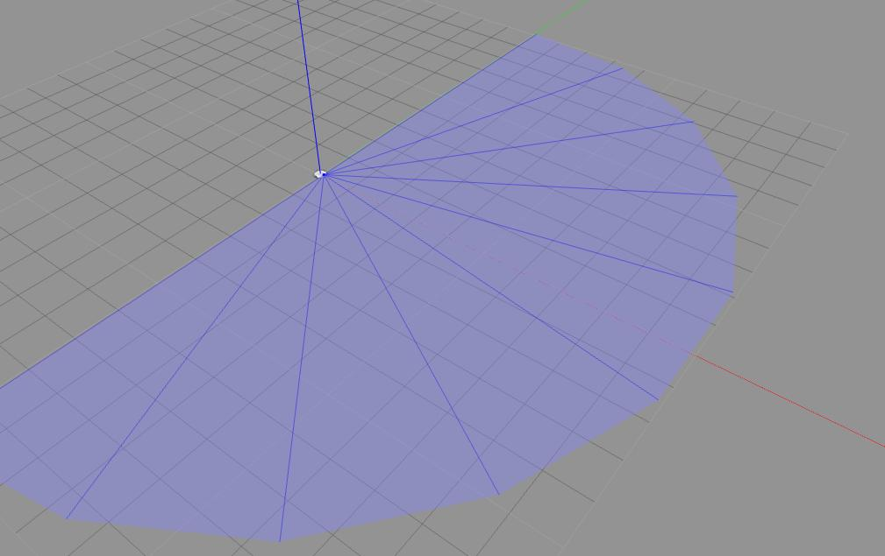
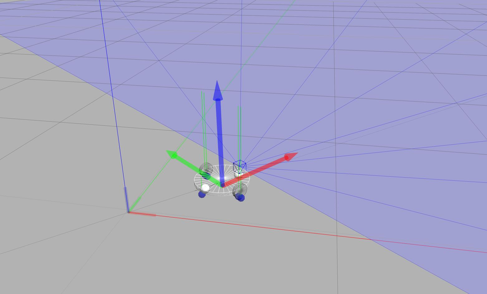
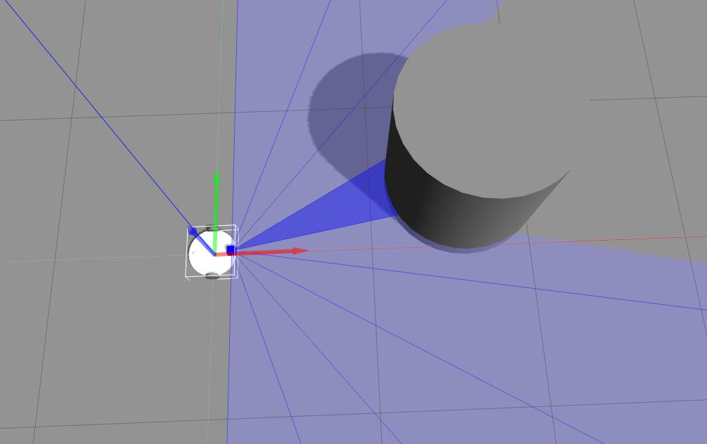

# ROS仿真实验


# 1. Build robot

Build a mobile robot with a laser sensor.






## 1.1 Packages

create ROS packages:

1) mmbot_description

```
zhu@zhu-ThinkPad-X220:~/catkin_ws/src/mmbot_demo$ catkin_create_pkg mmbot_description

Created file mmbot_description/CMakeLists.txt
Created file mmbot_description/package.xml
Successfully created files in /home/zhu/catkin_ws/src/mmbot_demo/mmbot_description. Please adjust the values in package.xml.
```

2)  mmbot_gazebo

```
zhu@zhu-ThinkPad-X220:~/catkin_ws/src/mmbot_demo$ catkin_create_pkg mmbot_gazebo

Created file mmbot_gazebo/CMakeLists.txt
Created file mmbot_gazebo/package.xml
Successfully created files in /home/zhu/catkin_ws/src/mmbot_demo/mmbot_gazebo. Please adjust the values in package.xml.
```

3)  mmbot_control

```
zhu@zhu-ThinkPad-X220:~/catkin_ws/src/mmbot_demo$ catkin_create_pkg mmbot_control rospy roscpp

Created file mmbot_control/CMakeLists.txt
Created file mmbot_control/package.xml
Created folder mmbot_control/include/mmbot_control
Created folder mmbot_control/src
Successfully created files in /home/zhu/catkin_ws/src/mmbot_demo/mmbot_control. Please adjust the values in package.xml.
```


## 1.2 Key files

### 1) mmbot.xacro

```xml
<?xml version="1.0"?>
<robot name="mmrobot" xmlns:xacro="http://www.ros.org/wiki/xacro">
  
<xacro:include filename="$(find mmbot_description)/urdf/wheel.xacro" />

<!-- Defining the colors used in this robot -->
  <material name="Black">
    <color rgba="0.0 0.0 0.0 1.0"/>
  </material>

  <material name="Red">
    <color rgba="0.8 0.0 0.0 1.0"/>
  </material>

  <material name="White">
    <color rgba="1.0 1.0 1.0 1.0"/>
  </material>

  <material name="Blue">
    <color rgba="0.0 0.0 0.8 1.0"/>
  </material>

<!-- PROPERTY LIST -->
  <!--All units in m-kg-s-radians unit system -->
  <property name="M_PI" value="3.1415926535897931" />
  <property name="M_PI_2" value="1.570796327" />
  <property name="DEG_TO_RAD" value="0.017453293" />

  <!-- Main body radius and height -->
  <!-- Main Body Cylinder base   -->
  <property name="base_height" value="0.02" /> 
  <property name="base_radius" value="0.15" /> 
  <property name="base_mass" value="5" /> <!-- in kg-->

  <!-- caster wheel radius and height -->
  <!-- caster wheel mass -->
  <property name="caster_f_height" value="0.04" /> 
  <property name="caster_f_radius" value="0.025" /> 
  <property name="caster_f_mass" value="0.5" /> <!-- in kg-->

  <!-- caster wheel radius and height -->
  <!-- caster wheel mass -->
  <property name="caster_b_height" value="0.04" /> 
  <property name="caster_b_radius" value="0.025" /> 
  <property name="caster_b_mass" value="0.5" /> <!-- in kg-->

  <!-- Wheels -->
  <property name="wheel_mass" value="2.5" /> <!-- in kg-->
  
  <property name="base_x_origin_to_wheel_origin" value="0.25" />
  <property name="base_y_origin_to_wheel_origin" value="0.3" />
  <property name="base_z_origin_to_wheel_origin" value="0.0" />

  <!-- Hokuyo Laser scanner -->
  <property name="hokuyo_size" value="0.05" />

  <!-- Macro for calculating inertia of cylinder -->
  <macro name="cylinder_inertia" params="m r h">
    <inertia  ixx="${m*(3*r*r+h*h)/12}" ixy = "0" ixz = "0"
              iyy="${m*(3*r*r+h*h)/12}" iyz = "0"
              izz="${m*r*r/2}" /> 
  </macro>

<!-- BASE-FOOTPRINT -->
<!-- base_footprint is a fictitious link(frame) that is on the ground right below base_link origin -->
  <link name="base_footprint">
    <inertial>
      <mass value="0.0001" />
      <origin xyz="0 0 0" />
      <inertia ixx="0.0001" ixy="0.0" ixz="0.0"
          iyy="0.0001" iyz="0.0" 
          izz="0.0001" />
    </inertial>
    <visual>
        <origin xyz="0 0 0" rpy="0 0 0" />
        <geometry>
            <box size="0.001 0.001 0.001" />
        </geometry>
    </visual>
  </link>

  <gazebo reference="base_footprint">
    <turnGravityOff>false</turnGravityOff>
  </gazebo>

  <joint name="base_footprint_joint" type="fixed">
    <origin xyz="0 0 ${wheel_radius - base_z_origin_to_wheel_origin}" rpy="0 0 0" />
    <parent link="base_footprint"/>
    <child link="base_link" />
  </joint>
  
<!-- BASE-LINK -->
<!--Actual body/chassis of the robot-->
  <link name="base_link">
    <inertial>
      <mass value="${base_mass}" />
      <origin xyz="0 0 0" />
      <!--The 3x3 rotational inertia matrix. -->
      <cylinder_inertia  m="${base_mass}" r="${base_radius}" h="${base_height}" />

    </inertial>    
    <visual>
      <origin xyz="0 0 0" rpy="0 0 0" />
      <geometry>
        <cylinder length="${base_height}" radius="${base_radius}" />
      </geometry>
      <material name="White" />
    </visual>  
    <collision>
      <origin xyz="0 0 0" rpy="0 0 0 " />
      <geometry>
          <cylinder length="${base_height}" radius="${base_radius}" />
      </geometry>
    </collision>     
  </link>
  <gazebo reference="base_link">
    <material>Gazebo/White</material>
    <turnGravityOff>false</turnGravityOff>
  </gazebo>
  
<!--Caster front  -->
  <link name="caster_front_link">
    <visual>
      <origin xyz="0 0.02 0" rpy="${M_PI/2} 0 0" />
      <geometry>
        <sphere radius="${caster_f_radius}" />
      </geometry>
      <material name="Black" />
    </visual>  
    <collision>
        <geometry>
          <sphere radius="${caster_f_radius}" />
        </geometry>
        <origin xyz="0 0.02 0" rpy="${M_PI/2} 0 0" />
    </collision>
    <inertial>
        <mass value="${caster_f_mass}" />
        <origin xyz="0 0 0" />
        <inertia ixx="0.001" ixy="0.0" ixz="0.0"
                 iyy="0.001" iyz="0.0" 
                 izz="0.001" />
    </inertial>
  </link>

  <joint name="caster_front_joint" type="fixed">
      <parent link="base_link"/>
      <child link="caster_front_link"/>
      <origin xyz="0.115 0.0 0.007" rpy="${-M_PI/2} 0 0"/>
  </joint>

  <gazebo reference="caster_front_link">
    <turnGravityOff>false</turnGravityOff>
  </gazebo>

<!--Caster back  -->
  <link name="caster_back_link">
    <visual>
      <origin xyz="0.02 0.02 0 " rpy="${M_PI/2} 0 0" /> 
      <geometry>
        <sphere radius="${caster_b_radius}" />
      </geometry>
      <material name="Black" />
    </visual>  
    <collision>
      <geometry>
        <sphere radius="${caster_b_radius}" />
      </geometry>
      <origin xyz="0 0.02 0 " rpy="${M_PI/2} 0 0" /> 
    </collision>
    <inertial>
      <mass value="${caster_b_mass}" />
      <origin xyz="0 0 0" />
      <inertia ixx="0.001" ixy="0.0" ixz="0.0"
               iyy="0.001" iyz="0.0"
               izz="0.001" />
    </inertial>
  </link>

  <joint name="caster_back_joint" type="fixed">
      <parent link="base_link"/>
      <child link="caster_back_link"/>
      <origin xyz="-0.135 0.0 0.009" rpy="${-M_PI/2} 0 0"/>
  </joint>
  <gazebo reference="caster_back_link">
    <turnGravityOff>false</turnGravityOff>
  </gazebo>

<!-- Wheel Definitions -->
  <wheel fb="front" lr="right" parent="base_link" translateX="0" translateY="0.5" flipY="1"/>
  <wheel fb="front" lr="left" parent="base_link" translateX="0" translateY="-0.5" flipY="1"/>
	 
<!-- SENSORS -->
<!-- hokuyo -->
  <link name="hokuyo_link">
    <visual>
      <origin xyz="0 0 0" rpy="0 0 0" />
      <geometry>
        <box size="${hokuyo_size} ${hokuyo_size} ${hokuyo_size}"/>
      </geometry>
      <material name="Blue" />
    </visual>
  </link>

  <joint name="hokuyo_joint" type="fixed">
    <origin xyz="${base_radius - hokuyo_size/2} 0 ${base_height+hokuyo_size/4}" rpy="0 0 0" />
    <parent link="base_link"/>
    <child link="hokuyo_link" />
  </joint>

  <gazebo reference="hokuyo_link">
    <material>Gazebo/Blue</material>
    <turnGravityOff>false</turnGravityOff>
    <sensor type="ray" name="head_hokuyo_sensor">
      <pose>${hokuyo_size/2} 0 0 0 0 0</pose>
      <visualize>true</visualize>
      <update_rate>5</update_rate>
      <ray>
        <scan>
          <horizontal>
            <samples>10</samples>
            <resolution>1</resolution>
            <min_angle>-1.570796</min_angle>
            <max_angle>1.570796</max_angle>
          </horizontal>
        </scan>
        <range>
          <min>0.10</min>
          <max>10.0</max>
          <resolution>0.001</resolution>
        </range>
      </ray>
      <plugin name="gazebo_ros_head_hokuyo_controller" filename="libgazebo_ros_laser.so">
        <topicName>/scan</topicName>
        <frameName>hokuyo_link</frameName>
      </plugin>
    </sensor>
  </gazebo>
  
<!-- Differential drive controller  -->
  <gazebo>
    <plugin name="differential_drive_controller" filename="libgazebo_ros_diff_drive.so">
      <rosDebugLevel>Debug</rosDebugLevel>
      <publishWheelTF>false</publishWheelTF>
      <robotNamespace>/</robotNamespace>
      <publishTf>1</publishTf>
      <publishWheelJointState>false</publishWheelJointState>
      <alwaysOn>true</alwaysOn>
      <updateRate>10.0</updateRate>
      <leftJoint>front_left_wheel_joint</leftJoint>
      <rightJoint>front_right_wheel_joint</rightJoint>
      <wheelSeparation>${2*base_radius}</wheelSeparation>
      <wheelDiameter>${2*wheel_radius}</wheelDiameter>
      <broadcastTF>1</broadcastTF>
      <wheelTorque>30</wheelTorque>
      <wheelAcceleration>1.8</wheelAcceleration>
      <commandTopic>cmd_vel</commandTopic>
      <odometryFrame>odom</odometryFrame> 
      <odometryTopic>odom</odometryTopic> 
      <robotBaseFrame>base_footprint</robotBaseFrame>
      <legacyMode>true</legacyMode>
      <odometrySource>world</odometrySource>
    </plugin>
  </gazebo> 

</robot>
```


### 2) wheel.xacro

```xml
<?xml version="1.0"?>
<robot name="wheel" xmlns:xacro="http://www.ros.org/wiki/xacro">
  
  <!-- Wheels -->
  <property name="wheel_radius" value="0.04" /> 
  <property name="wheel_height" value="0.02" />
  <property name="wheel_mass" value="2.5" /> <!-- in kg-->
  
  <property name="base_x_origin_to_wheel_origin" value="0.25" />
  <property name="base_y_origin_to_wheel_origin" value="0.3" />
  <property name="base_z_origin_to_wheel_origin" value="0.0" />
  
  <macro name="cylinder_inertia" params="m r h">
    <inertia  ixx="${m*(3*r*r+h*h)/12}" ixy = "0" ixz = "0"
              iyy="${m*(3*r*r+h*h)/12}" iyz = "0"
              izz="${m*r*r/2}" /> 
  </macro>
  
  <xacro:macro name="wheel" params="fb lr parent translateX translateY flipY"> <!--fb : front, back ; lr: left, right -->
    <link name="${fb}_${lr}_wheel">
      <visual>
        <origin xyz="0 0 0" rpy="${flipY*M_PI/2} 0  0 " /> 
        <geometry>
          <cylinder length="${wheel_height}" radius="${wheel_radius}" />
        </geometry>
        <material name="DarkGray" />
      </visual>
      <collision>
        <origin xyz="0 0 0" rpy="${flipY*M_PI/2} 0 0 " />
        <geometry>
          <cylinder length="${wheel_height}" radius="${wheel_radius}" />
        </geometry>
      </collision>
      <inertial>
        <mass value="${wheel_mass}" />
        <origin xyz="0 0 0" />
        <cylinder_inertia  m="${wheel_mass}" r="${wheel_radius}" h="${wheel_height}" />
      </inertial>
    </link>

    <gazebo reference="${fb}_${lr}_wheel">
      <mu1 value="1.0"/>
      <mu2 value="1.0"/>
      <kp  value="10000000.0" />
      <kd  value="1.0" />
      <fdir1 value="1 0 0"/>
      <material>Gazebo/Grey</material>
      <turnGravityOff>false</turnGravityOff>
    </gazebo>

    <joint name="${fb}_${lr}_wheel_joint" type="continuous">
      <parent link="${parent}"/>
      <child link="${fb}_${lr}_wheel"/>
      <origin xyz="${translateX * base_x_origin_to_wheel_origin} ${translateY * base_y_origin_to_wheel_origin} ${base_z_origin_to_wheel_origin}" rpy="0 0 0" /> 
      <axis xyz="0 1 0" rpy="0  0" />
      <limit effort="100" velocity="100"/>
      <joint_properties damping="0.0" friction="0.0"/>
    </joint>

    <!-- Transmission is important to link the joints and the controller -->
    <transmission name="${fb}_${lr}_wheel_joint_trans">
      <type>transmission_interface/SimpleTransmission</type>
      <joint name="${fb}_${lr}_wheel_joint" />
      <actuator name="${fb}_${lr}_wheel_joint_motor">
        <hardwareInterface>EffortJointInterface</hardwareInterface>
        <mechanicalReduction>1</mechanicalReduction>
      </actuator>
    </transmission>
   
  </xacro:macro>
</robot>
```


### 3) mmbot_gazebo.launch

```xml
<launch>

  <!-- these are the arguments you can pass this launch file, for example paused:=true -->
  <arg name="paused" default="false"/>
  <arg name="use_sim_time" default="true"/>
  <arg name="gui" default="true"/>
  <arg name="headless" default="false"/>
  <arg name="debug" default="false"/>

  <!-- We resume the logic in empty_world.launch -->
  <include file="$(find gazebo_ros)/launch/empty_world.launch">
    <arg name="debug" value="$(arg debug)" />
    <arg name="gui" value="$(arg gui)" />
    <arg name="paused" value="$(arg paused)"/>
    <arg name="use_sim_time" value="$(arg use_sim_time)"/>
    <arg name="headless" value="$(arg headless)"/>
  </include>

  <!-- urdf xml robot description loaded on the Parameter Server-->
  <param name="robot_description" command="$(find xacro)/xacro.py '$(find ros_robot_description_pkg)/urdf/diff_wheeled_robot.xacro'" /> 


  <!-- Run a python script to the send a service call to gazebo_ros to spawn a URDF robot -->
  <node name="urdf_spawner" pkg="gazebo_ros" type="spawn_model" respawn="false" output="screen"
	args="-urdf -model diff_wheeled_robot -param robot_description"/> 

</launch>
```


# 2. Write robot controllers

Directory: mmbot_control 

```
.
├── CMakeLists.txt
├── include
│   └── mmbot_control
├── package.xml
├── scripts
│   ├── avoid
│   ├── goto
│   ├── key
│   └── where
└── src
```


## 2.1 key

Control robot by keyboard.

```python
#!/usr/bin/env python

# Copyright (c) 2011, Willow Garage, Inc.
# All rights reserved.
#
# Redistribution and use in source and binary forms, with or without
# modification, are permitted provided that the following conditions are met:
#
#    * Redistributions of source code must retain the above copyright
#      notice, this list of conditions and the following disclaimer.
#    * Redistributions in binary form must reproduce the above copyright
#      notice, this list of conditions and the following disclaimer in the
#      documentation and/or other materials provided with the distribution.
#    * Neither the name of the Willow Garage, Inc. nor the names of its
#      contributors may be used to endorse or promote products derived from
#       this software without specific prior written permission.
#
# THIS SOFTWARE IS PROVIDED BY THE COPYRIGHT HOLDERS AND CONTRIBUTORS "AS IS"
# AND ANY EXPRESS OR IMPLIED WARRANTIES, INCLUDING, BUT NOT LIMITED TO, THE
# IMPLIED WARRANTIES OF MERCHANTABILITY AND FITNESS FOR A PARTICULAR PURPOSE
# ARE DISCLAIMED. IN NO EVENT SHALL THE COPYRIGHT OWNER OR CONTRIBUTORS BE
# LIABLE FOR ANY DIRECT, INDIRECT, INCIDENTAL, SPECIAL, EXEMPLARY, OR
# CONSEQUENTIAL DAMAGES (INCLUDING, BUT NOT LIMITED TO, PROCUREMENT OF
# SUBSTITUTE GOODS OR SERVICES; LOSS OF USE, DATA, OR PROFITS; OR BUSINESS
# INTERRUPTION) HOWEVER CAUSED AND ON ANY THEORY OF LIABILITY, WHETHER IN
# CONTRACT, STRICT LIABILITY, OR TORT (INCLUDING NEGLIGENCE OR OTHERWISE)
# ARISING IN ANY WAY OUT OF THE USE OF THIS SOFTWARE, EVEN IF ADVISED OF THE
# POSSIBILITY OF SUCH DAMAGE.

import rospy

from geometry_msgs.msg import Twist

import sys, select, termios, tty

msg = """
Control Your Turtlebot!
---------------------------
Moving around:
   u    i    o
   j    k    l
   m    ,    .

q/z : increase/decrease max speeds by 10%
w/x : increase/decrease only linear speed by 10%
e/c : increase/decrease only angular speed by 10%
space key, k : force stop
anything else : stop smoothly

CTRL-C to quit
"""

moveBindings = {
        'i':(1,0),
        'o':(1,-1),
        'j':(0,1),
        'l':(0,-1),
        'u':(1,1),
        ',':(-1,0),
        '.':(-1,1),
        'm':(-1,-1),
           }

speedBindings={
        'q':(1.1,1.1),
        'z':(.9,.9),
        'w':(1.1,1),
        'x':(.9,1),
        'e':(1,1.1),
        'c':(1,.9),
          }

def getKey():
    tty.setraw(sys.stdin.fileno())
    rlist, _, _ = select.select([sys.stdin], [], [], 0.1)
    if rlist:
        key = sys.stdin.read(1)
    else:
        key = ''

    termios.tcsetattr(sys.stdin, termios.TCSADRAIN, settings)
    return key

speed = .2
turn = 1

def vels(speed,turn):
    return "currently:\tspeed %s\tturn %s " % (speed,turn)

if __name__=="__main__":
    settings = termios.tcgetattr(sys.stdin)
    
    rospy.init_node('turtlebot_teleop')
    pub = rospy.Publisher('/cmd_vel', Twist, queue_size=5)

    x = 0
    th = 0
    status = 0
    count = 0
    acc = 0.1
    target_speed = 0
    target_turn = 0
    control_speed = 0
    control_turn = 0
    try:
        print msg
        print vels(speed,turn)
        while(1):
            key = getKey()
            if key in moveBindings.keys():
                x = moveBindings[key][0]
                th = moveBindings[key][1]
                count = 0
            elif key in speedBindings.keys():
                speed = speed * speedBindings[key][0]
                turn = turn * speedBindings[key][1]
                count = 0

                print vels(speed,turn)
                if (status == 14):
                    print msg
                status = (status + 1) % 15
            elif key == ' ' or key == 'k' :
                x = 0
                th = 0
                control_speed = 0
                control_turn = 0
            else:
                count = count + 1
                if count > 4:
                    x = 0
                    th = 0
                if (key == '\x03'):
                    break

            target_speed = speed * x
            target_turn = turn * th

            if target_speed > control_speed:
                control_speed = min( target_speed, control_speed + 0.02 )
            elif target_speed < control_speed:
                control_speed = max( target_speed, control_speed - 0.02 )
            else:
                control_speed = target_speed

            if target_turn > control_turn:
                control_turn = min( target_turn, control_turn + 0.1 )
            elif target_turn < control_turn:
                control_turn = max( target_turn, control_turn - 0.1 )
            else:
                control_turn = target_turn

            twist = Twist()
            twist.linear.x = control_speed; twist.linear.y = 0; twist.linear.z = 0
            twist.angular.x = 0; twist.angular.y = 0; twist.angular.z = control_turn
            pub.publish(twist)

            #print("loop: {0}".format(count))
            #print("target: vx: {0}, wz: {1}".format(target_speed, target_turn))
            #print("publihsed: vx: {0}, wz: {1}".format(twist.linear.x, twist.angular.z))

    except:
        print e

    finally:
        twist = Twist()
        twist.linear.x = 0; twist.linear.y = 0; twist.linear.z = 0
        twist.angular.x = 0; twist.angular.y = 0; twist.angular.z = 0
        pub.publish(twist)

    termios.tcsetattr(sys.stdin, termios.TCSADRAIN, settings)

```


## 2.2 where 

Tell where is the robot.

```python
#!/usr/bin/env python

# Copyright(c) 2017, SCUT RIS
# author : Jinhui Zhu

import rospy

from nav_msgs.msg import Odometry


def odom_callback(data):
	rx = data.pose.pose.position.x;
	ry = data.pose.pose.position.y;
	rospy.loginfo(rospy.get_caller_id()+": %.2f %.2f",rx,ry);


if __name__ == "__main__":
	rospy.init_node("where");

	sub = rospy.Subscriber('/odom',Odometry, odom_callback);

	rospy.spin();
```


## 2.3 avoid

When the robot moving, it can avoid obstacles.

Write a ROS node.  The node subscirbes topic **/scan** and publish topic **/cmd_vel**.




## 2.4 goto

The robot  can move to a goal(x,y).

Write a ROS node.  The node subscirbes topic **/odom** and publishes topic **/cmd_vel**.


## 2.5 hybrid

The robot  can move to a goal(x,y). 

When the robot moving, it can avoid obstacles.

Write a ROS node.  The node subscirbes topic **/odom** and **/scan**; publishes topic **/cmd_vel**.


# 3. References

## 3.1 RRbot

Category: Connect to ROS. 
http://www.gazebosim.org/tutorials?cat=connect_ros

ROS is a robot control framework. These tutorials describe how to interface Gazebo and ROS.

RRBot exmaple:
RRBot, or ''Revolute-Revolute Manipulator Robot'', is a simple 3-linkage, 2-joint arm that we will use to demonstrate various features of Gazebo and URDFs. It essentially a double inverted pendulum and demonstrates some fun control concepts within a simulator.

To get RRBot, clone the [gazebo_ros_demos Github repo](https://github.com/ros-simulation/gazebo_ros_demos.git) into the `/src` folder of your catkin workspace and rebuild your workspace:

```shell
cd ~/catkin_ws/src/
git clone https://github.com/ros-simulation/gazebo_ros_demos.git
cd ..
catkin_make
```


Start the RRBot simulation:

```
roslaunch rrbot_gazebo rrbot_world.launch
```

Load the controllers for the two joints by running the second launch file:

```
roslaunch rrbot_control rrbot_control.launch
```

Send example joint commands to them for testing:

```
rostopic pub -1 /rrbot/joint1_position_controller/command std_msgs/Float64 "data: 1.5"
rostopic pub -1 /rrbot/joint2_position_controller/command std_msgs/Float64 "data: 1.0"
```


## 3.2 Turtlesim

http://wiki.ros.org/turtlesim/Tutorials/Go%20to%20Goal

```python
#!/usr/bin/env python
import rospy
from geometry_msgs.msg  import Twist
from turtlesim.msg import Pose
from math import pow,atan2,sqrt

class turtlebot():

    def __init__(self):
        #Creating our node,publisher and subscriber
        rospy.init_node('turtlebot_controller', anonymous=True)
        self.velocity_publisher = rospy.Publisher('/turtle1/cmd_vel', Twist, queue_size=10)
        self.pose_subscriber = rospy.Subscriber('/turtle1/pose', Pose, self.callback)
        self.pose = Pose()
        self.rate = rospy.Rate(10)

    #Callback function implementing the pose value received
    def callback(self, data):
        self.pose = data
        self.pose.x = round(self.pose.x, 4)
        self.pose.y = round(self.pose.y, 4)

    def get_distance(self, goal_x, goal_y):
        distance = sqrt(pow((goal_x - self.pose.x), 2) + pow((goal_y - self.pose.y), 2))
        return distance

    def move2goal(self):
        goal_pose = Pose()
        goal_pose.x = input("Set your x goal:")
        goal_pose.y = input("Set your y goal:")
        distance_tolerance = input("Set your tolerance:")
        vel_msg = Twist()

        while sqrt(pow((goal_pose.x - self.pose.x), 2) + pow((goal_pose.y - self.pose.y), 2)) >= distance_tolerance:

            #Porportional Controller
            #linear velocity in the x-axis:
            vel_msg.linear.x = 1.5 * sqrt(pow((goal_pose.x - self.pose.x), 2) + pow((goal_pose.y - self.pose.y), 2))
            vel_msg.linear.y = 0
            vel_msg.linear.z = 0

            #angular velocity in the z-axis:
            vel_msg.angular.x = 0
            vel_msg.angular.y = 0
            vel_msg.angular.z = 4 * (atan2(goal_pose.y - self.pose.y, goal_pose.x - self.pose.x) - self.pose.theta)

            #Publishing our vel_msg
            self.velocity_publisher.publish(vel_msg)
            self.rate.sleep()
        #Stopping our robot after the movement is over
        vel_msg.linear.x = 0
        vel_msg.angular.z =0
        self.velocity_publisher.publish(vel_msg)

        rospy.spin()

if __name__ == '__main__':
    try:
        #Testing our function
        x = turtlebot()
        x.move2goal()

    except rospy.ROSInterruptException: pass
```


The turtle will move like this:


