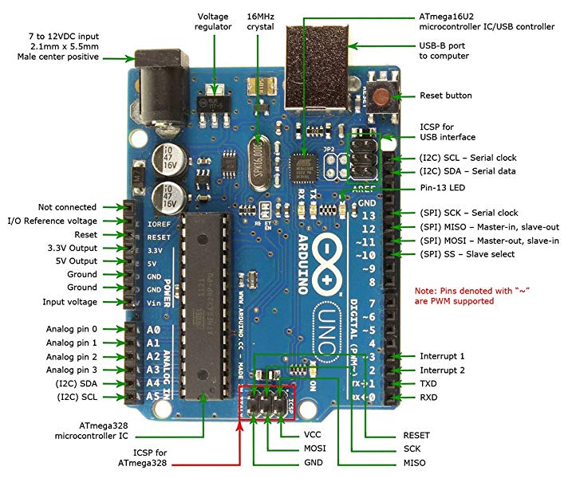
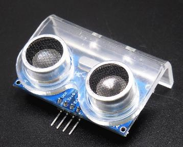
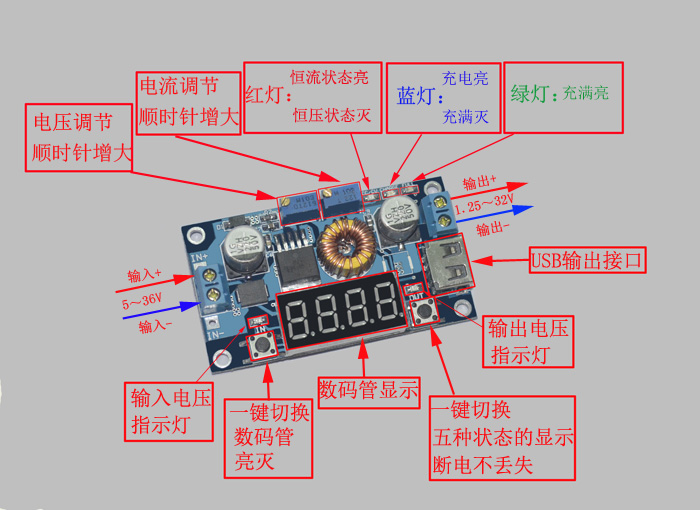

# 基于Arduino的机器人编程

# 1. 实验目的

1）掌握机器人的硬件组成

2）掌握arduino编程

# 2. 实验材料
## 2.1 Arduino控制板UNO
产品1

产品2

## 2.2 红外避障模块

## 2.3 超声波测距模块及支架

## 2.4 电机驱动模块L298N

正面

背面

控制

电池盒的输出连接+12v和GND。+5v不用接。
IN1、IN2、IN3、IN4连接Arduino。
OUT1和OUT2连接2个电机。

## 2.5 电源稳压模块

调节电压，输出5v。
一路输出（USB），连接控制板UNO的USB；
另一路输出，连接面包板，提供电源给其他设备。

## 2.6 车体及电机

## 2.7 面包板

每一组的五孔是联通的，组组之间不连通。

## 2.8 杜邦线

杜邦线的两端是公头或母头。

## 2.9 电池

2节18650锂电池，单节3.7v。

## 2.10 电池盒

两节电池串联，电池盒带开关。

放入电池前，确保开关处于关闭状态，防止短路。

# 3. 实验内容

## 3.1 软件模块

编写各个模块的测试程序，包括：

1) 板载LED

提示：使用digitalWrite函数。

2) 串口通信

提示：使用Serial对象。

3) 红外避障

提示：使用digitalRead函数。

4) 超声波测距

提示： 

单片机的一个输出管脚接Trig，一个输入管脚接Echo。

使用pulseIn函数测量Echo的脉冲宽度。

5) 电机驱动

提示： 

使用PWM控制电机速度。

使用analogWrite输出PWM。

## 3.2 组装机器人

将机器人底盘、轮子、电池、控制器等组合为一个完整机器人，用于机器人走迷宫。

机器人前方安装两个红外避障传感器，右侧安装一个超声波测距传感器。

## 3.3 机器人走迷宫

编写走迷宫机器人程序。

提示：

机器人控制策略是一直靠右墙走。

