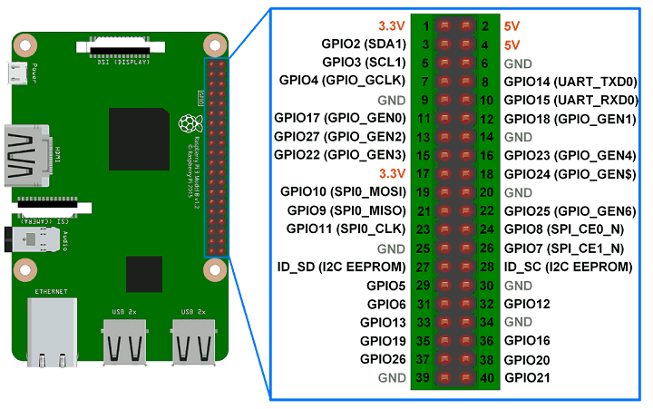

# 基于Raspberry Pi的机器人编程

# 1. 实验目的
1）掌握RaspberryPi的基本用法

2）掌握基于脚本的机器人编程


# 2. 实验材料
## 2.1 RaspberryPi嵌入式板




**注意管脚编号在板上的物理位置，其中39和40是靠近USB口的。**


## 2.2 机器人车体及传感器
与《基于Arduino的机器人编程》实验中的设备一样


# 3. 实验内容
## 3.1 安装软件和配置
### 3.1.1 Raspbian系统

安装Raspbian系统到SD卡

过程可参考： https://projects.raspberrypi.org/en/projects/raspberry-pi-setting-up

下载地址：https://www.raspberrypi.org/downloads/


### 3.1.2 WiFi热点

安装RaspAP，配置树莓派为一个wifi热点，修改热点名称和密码。

操作过程见https://github.com/billz/raspap-webgui的readme.md

成功后，PC可以远程ssh登录到树莓派，而不需要网线和显示器。


### 3.1.3 WringPi-Python库

安装：

```
pip3 install wiringpi
```

参考例子见源代码：

https://github.com/WiringPi/WiringPi-Python

wiringPi的管脚编号：


## 3.3 组装机器人

将RaspberryPi板替换《基于Arduino的机器人编程》中的Arduino Uno板。

连线RaspberryPi与外围设备。

**注意事项：**

1. 连线前，请断开电源开关。
2. 确认P1排针的管脚编号1的位置，管脚39和40是靠近USB口。


## 3.4 软件模块

编写各个模块的测试程序，包括：

### 3.4.1 红外障碍物检测

提示：使用digitalRead函数。


### 3.4.2 超声波测距

提示： 

选择一个管脚接Trig，一个管脚接Echo；

用wiringpi.digitalWrite输出到Trig；

用time.sleep做延迟；

使用wiringpi.digitalRead读取Echo；

用time.time()读取2次时间。


### 3.4.3 电机驱动

提示： 

使用PWM控制电机速度。

参考例子：https://github.com/WiringPi/WiringPi-Python/blob/master/examples/softpwm.py

初始化PWM输出口PinX： wiringpi.softPwmCreate(pinX,1,500)

输出PWM信号到PinX：wiringpi.softPwmWrite(pinX,Y)


## 3.5 机器人走迷宫

编写走迷宫机器人程序。


提示：

机器人控制策略是一直靠右墙走。

