## AudioAR
# 软件架构文档

版本<1>

修订历史记录

|日期|版本|修订说明|作者|
|:-|:-|:-|:-|
|2018-04-27|0|提供基本的格式|刘知峻|
|2018-05-01|1|撰写引言部分|缪本杰|


## 1. 引言

### 1.1 编写目的
本文档拟定软件架构的设计，包括分解子系统、子系统之间的服务、子系统中的对象模型与详细的流程顺序图。本文档确定了项目开发时的大体结构，指导之后的系统实现。

### 1.2 适用范围
此文档适用于AudioAR项目的全部软件及系统。

### 1.3 定义
相关定义见词汇表[@doc/需求定义和分析/词汇表.md](/需求定义和分析/词汇表.md)

### 1.4 参考资料
|文件标题|文件编号|发表日期|出版单位|来源|
|:-:|:-|:-|:-|:-|
|面向对象软件工程实践指南|ISBN9787313162182|2016年 12月 第1版|上海交通大学出版社|图书资料|
|软件架构设计模版|-|-|-|-|课程资料|

### 1.5 概述
本文档首先[在第2部分]整理了目前业界存在的类似软件系统架构，并[在第3部分]提出了本软件系统架构的设计目标。之后[在第4部分]我们详细定义我们建议的软件系统架构。

## 2. 目前的软件系统架构
[@doc/计划/可行性研究报告.md#行业现有系统分析](https://github.com/AudioAR/doc/blob/master/%E8%AE%A1%E5%88%92/%E5%8F%AF%E8%A1%8C%E6%80%A7%E7%A0%94%E7%A9%B6%E6%8A%A5%E5%91%8A.md#3-%E8%A1%8C%E4%B8%9A%E7%8E%B0%E6%9C%89%E7%B3%BB%E7%BB%9F%E5%88%86%E6%9E%90)

## 3. 软件系统架构设计目标
根据[@doc/需求定义与分析/软件需求规约](/需求定义和分析/软件需求规约.md#33-非功能需求)中的“非功能需求”部分，我们进一步整理出系统架构的设计目标如下：
- 可用性：生成的虚拟声场拥有声音的真实性，音频流与真实的立体声音难以区分
- 实时性：实时生成的音频流不具有明显的卡顿
- 可靠性：要求的运行环境内可以长时间、无差错、少维护地工作
- 性能要求：用户位置的获取具有水平5m左右，垂直20cm左右的精确度；头部运动捕捉比较准确
- 可支持性：可扩展的吞吐量和服务提供能力，服务器能稳定提供几名用户的资源请求和相关通讯

## 4. 建议的软件系统架构

### 4.1 概述
本软件在整体上采用MVVM的系统架构，最大程度地使UI界面和数据模型解耦合。

在系统逻辑方面，共分为十个子系统，分别处理不同的任务模块。

系统采用Client-Server的模式，通过服务器来完成用户与在线数据的交互。服务器端使用数据库进行数据存储，本地使用安卓自带的SQLite模块进行本地数据存取。

下面介绍具体的软件设计架构模型。
- [用例视图](#42-用例视图)
- [系统逻辑视图](#43-系统逻辑视图)
- [系统运行视图](#44-系统运行视图)
- [系统实现视图](#45-系统实现视图)
- [系统物理视图](#46-系统物理视图)
- [边界条件设计](#47-边界条件设计)

### 4.2 用例视图
详见[@需求定义和分析/软件需求规约.md](../需求定义和分析/软件需求规约.md#342-用例模型)中的用例视图。

### 4.3 系统逻辑视图
#### 4.3.1 子系统分解

子系统划分为十一大部分，其中各个子系统的功能说明如下：

|子系统名称|功能|提供服务|接口形式|
|:-|:-|:-|:-|
|UISubsystem|提供用户界面和用户界面控制，包含了许多相对独立的ViewModels，同时完成VSS场景游览的工作|-|-|-|
|UserSubsystem|提供用户信息相关的服务|-|Java|
|OnlineVSSSubsystem|关于在线VSS相关的所有服务，包括在线VSS库的浏览、预览、评论、点赞等|-|Java|
|LocalVSSSubsystem|关于本地VSS相关的所有服务，包括创建、重命名、删除、上传、下载|-|Java|
|PlayVSSSubsystem|关于游览VSS的子系统|-|Java|
|CommunicationSubsystem|在本地和服务器端的通信子系统，实现显示简介、上传、下载、用户信息管理|UploadVSS<br>DownloadVSS<br>GetVSSReview<br>UserInfo|Java|
|SensorSubsystem|提供对处理过的传感器数据访问的子系统，通过访问传感器接口，客户能够接收到传感器提供的各种高级信息，包括经纬度，高度，速度，方向，加速等|SensorAccess|Java|
|SensorHardwareWrapper|传感器硬件封装系统|封装了各种传感器原始信息的获取工作，单独运行在一个线程中。一旦传感器连接，便开始自动运行。|Java|
|LocalStorageSubsystem|提供本地数据库访问|LocalStorage|Java|
|ServerSubsystem|服务器端的相关服务，该服务的接口属于Http接口，传输格式是json格式|WebAccess|HTTP-json|
|AudioSubsystem|使用Google VR提供的API来实现空间音频播放的功能|AudioControl|Java|

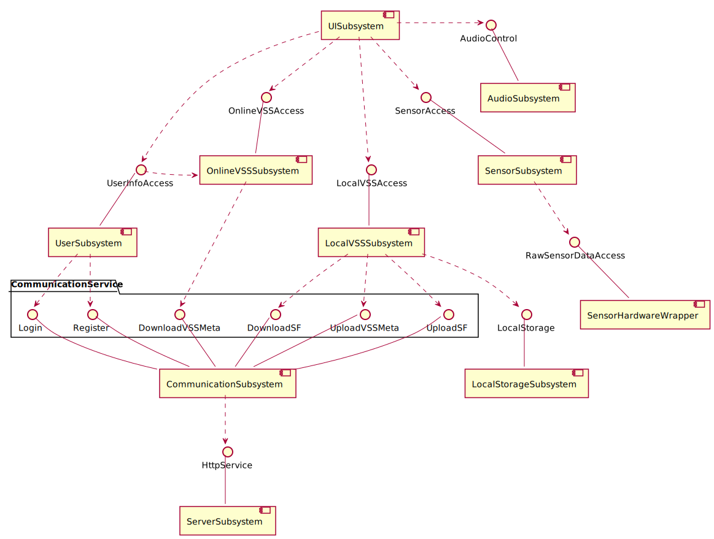
```PlantUML
@startuml Diagrams/SubsystemDecomposition
skinparam componentStyle uml2

interface "LocalStorage" as LS

interface "SensorAccess" as SA
interface "RawSensorDataAccess" as BC
interface "UserInfoAccess" as UIA
interface "OnlineVSSAccess" as OVA
interface "LocalVSSAccess" as LVA
interface "AudioControl" as AC


package "CommunicationService" {
    interface "UploadVSSMeta" as UM
    interface "DownloadVSSMeta" as DL
    interface "UploadSF" as GR
    interface "DownloadSF" as US
    interface "Register" as RG
    interface "Login" as LG
}
component "CommunicationSubsystem" as CommunicationSubsystem

    UM -- CommunicationSubsystem
    DL -- CommunicationSubsystem
    GR -- CommunicationSubsystem
    US -- CommunicationSubsystem
    RG -- CommunicationSubsystem
    LG -- CommunicationSubsystem

[LocalVSSSubsystem]
[OnlineVSSSubsystem]
[SensorSubsystem] -up- SA
[SensorHardwareWrapper] -up- BC
[SensorSubsystem] ..> BC
[UserSubsystem] -up- UIA
[UISubsystem] ..> UIA

[LocalStorageSubsystem] -up- LS
[LocalVSSSubsystem] ..> LS
[AudioSubsystem] -up- AC
[UISubsystem] .-r.> AC


UIA <. [OnlineVSSSubsystem]


[CommunicationSubsystem] .down.> HttpService
[ServerSubsystem] -up- HttpService
[OnlineVSSSubsystem] -up- OVA
[LocalVSSSubsystem] -up- LVA
[UserSubsystem] ..> LG
[UserSubsystem] ..> RG

[LocalVSSSubsystem] .down.> UM
[LocalVSSSubsystem] .up.> GR
[LocalVSSSubsystem] .down.> US

[OnlineVSSSubsystem] .-down.> DL
[OnlineVSSSubsystem] .[hidden].> US
[UISubsystem] -down.> OVA
[UISubsystem] .down.> LVA
[UISubsystem] ..> SA
@enduml
```
#### 4.3.2 子系统综述

##### 4.2.3.1 UISubsystem

###### 子系统接口定义
UISubsystem不提供接口

（撰写时的笔记，提交时请把这行删除）注：由于使用MVVM模式，所以UI子系统中的ViewModel类都分别体现在其他子系统中。这一子系统将会被用作各个ViewModel的方法预览；而各个ViewModel与其他子系统的关系将会在别处体现。所以在完成其他所有子系统接口的定义之后再回过来补充这一段。

###### 类图

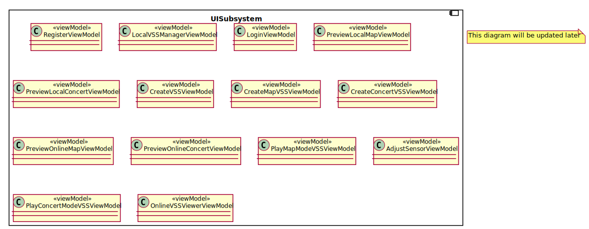

```PlantUML
@startuml Diagrams/UISubsystemClassDiagram
note "This diagram will be updated later" as notes

component UISubsystem {
    class RegisterPage <<page>> {
    }
    class LocalVSSManagerPage <<page>> {

    }
    class LoginPage <<page>> {

    }
    class PreviewPage <<page>> {

    }
    class CreateVSSPage <<page>> {

    }
    class CreateMapVSSPage <<page>> {

    }
    class CreateConcertVSSPage <<page>> {

    }
    class PlayMapModeVSSPage <<page>> {

    }
    class AdjustSensorPage <<page>> {

    }
    class PlayConcertModeVSSPage <<page>> {

    }
    class OnlineVSSViewerPage <<page>> {

    }
}

@enduml
```
##### 4.2.3.2 UserSubsystem
###### 功能
提供关于用户注册、登录、用户信息获取的服务。
###### 子系统接口定义
|Signature|Description|
|:-|:-|
|int register(String username, String password, String email)|第一个返回值为询问结果，-1表示用户名已存在，-2表示电子邮箱已被注册，否则表示注册成功，返回值为用户的ID|
|int login (String username, String password, boolean remember)|第一个返回值为问询结果，-1表示用户名不存在，-2表示密码错误，否则表示登录成功，返回值为用户的ID|
|int currentUserID()|返回当前登录用户的ID|
|String currentUsername()|返回当前登录用户的名字|

###### 类图


```PlantUML
@startuml Diagrams/UserSubsystemClassDiagram

component UserSubsystem {

    class UserInfoControl {
        login(username: String, password: String, remember: boolean): int
        setCurrentUser(userID: int, username: String): void
        rememberCurrentUser(): void
        checkLoginData(username: String, password: String): boolean
        }

    class RegisterPage <<page>> {
        ..private..
        - username: String
        - password: String
        - email: String
        - allowRegister: boolean
        ..public..
        + onRegisterButtonClicked(): void
        + alertUserExistent(): void
        + alertPasswordIllegal(): void
        + alertRegisterSuccessed(): void
    }

    class LoginPage <<page>> {
        ..private..
        - isLoginButtonClickable: boolean
        - username: String
        - password: String
        - rememberMe: boolean
        ..public..
        + onLoginDataChanged(): void
        + onRememberButtonToggled(): void
        + alertUserNonexistent(): void
        + alertPasswordError(): void
        + alertLoginSuccessed(): void
    }
}
UserInfoControl --() UserInfoAccess
@enduml
```


##### 4.2.3.3 OnlineVSSSubsystem

###### 子系统接口定义
###### 类图


```PlantUML
@startuml Diagrams/OnlineVSSSubsystemClassDiagram
component OnlineVSSSubsystem {
    class OnlineSoundSpaceLibrary {
    ..private..
    - nowPreviewVSSList: List<VirtualSoundSpace>
    ..public..
    + getPreview(int num): List<VirtualSoundSpace>
    + commentVSS(VirtualSoundSpace vss):void
    + likeVSS(VirtualSoundSpace vss):void
    }
}

OnlineSoundSpaceLibrary --() OnlineVSSAccess
@enduml
```
##### 4.2.3.4 LocalVSSSubsystem
###### 功能
关于本地VSS相关的所有服务，包括创建、重命名、删除、上传、下载
######  子系统接口定义


##### 4.2.3.5 PlayVSSSubsystem


##### 4.2.3.6 CommunicationSubsystem
###### 功能
提供客户端与服务器之间的通信服务，是对通信功能的一个封装。
这一子系统共提供四个功能接口，分别是（1）上传VSS（2）下载VSS（3）提供VSS简介（4）提供

###### 子系统接口定义
###### 类图


```PlantUML
@startuml Diagrams/CommunicationSubsystemClassDiagram
component CommunicationSubsystem {
    class Communicator {

    }
}
Communicator -() UploadVSSMeta
Communicator ---() DownloadVSSMeta
Communicator --() UploadSF
Communicator ---() DownloadSF
@enduml
```

##### 4.2.3.7 SensorSubsystem

###### 子系统接口定义

* SensorAccess implemented by **Sensor**

|Signature|Description|
|:-|:-|
|Position getCurrentLocation()|returns the latest updated position calculated fron sensor data.|
|boolean isSensorOnline() |returns the status of sensor, which can be offline and online.|
|void callWhenUpdated(Callable task)|give sensor a task object for it to call its this.run() method in another thread when an update of position is avaliable.|
|void callWhenUpdatedDelay(int millisecond)|the overload version of the above function only that this will not call callback function until assigned milliseconds has passed.|
|Quaternion getHeadPose()|returns a Quaternion describing the position of the user's head.|
|void clearTask()|remove all the tasks that are running. Notice that if the sensor goes offline, the Sensor class can not return to normal state but will stuck at the same Location and Pose.|

###### 类图

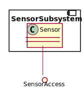

```PlantUML
@startuml Diagrams/SensorSubsystemClassDiagram
component SensorSubsystem {
    class Sensor {

    }
}
Sensor --() SensorAccess

@enduml
```
##### 4.2.3.8 SensorHardwareWrapper***该部分技术难度较高，推迟到相应的实现阶段进行***

##### 4.2.3.9 LocalStorageSubsystem
###### 子系统接口定义

###### 类图


```PlantUML
@startuml Diagrams/LocalStorageSubsystemClassDiagram
component LocalStorageSubsystem {
    class LocalStorage {

    }
}
LocalStorage --() LocalVSSAccess
@enduml
```

##### 4.2.3.10 ServerSubsystem
###### 子系统接口定义
|Signature|Description|
|:-|:-|
|(int,int) RegisterRequest(String username, String password, String email)|第一个返回值为询问结果，-1表示用户名已存在，0表示电子邮箱已被注册，1表示注册成功，第二个返回值为用户的ID，第一个返回值为-1或0的时候返回的ID为0|
|(int,int) LoginRequest( String username, String password)|第一个返回值为问询结果，-1表示用户名不存在，0表示密码错误，1表示登录成功，第二个返回值为登录用户对应的ID，若第一个返回值为-1或0则返回的ID为0|
|boolean UploadRequest(int VSSID, int UserID)|判断改VSS是否已在服务器中，如在则返回false，不在则返回true|
|List<**SFHash**> UploadRequest(List<**SFHash**>)|告知服务器即将上传的SF的SFHash，在服务器筛选掉重复的SF后返回正式的需要上传的SFHash列表|
|void UploadRequest(SFAddress)|根据要上传的SF的地址得到对应的SF并上传给服务器|
|void LikeRequest(int VSSID, int UserID)|更新服务器中的VSS_Like_Table以对相应的VSS增添新的点赞用户|
|void removeLike(int VSSID, int UserID)|更新服务器中的VSS_Like_Table以对相应的VSS删除该用户的点赞信息|
|SF DownloadRequest(SFHash)|向服务器发送需要下载的SF的SFHash，服务器将目标SF传到客户端|
|void CommentRequest(int VSSID, int UserID, String Comment)|将评论信息更新到服务器|
|List<**String**>,List<**String**> PreviewRequest(int VSSID)|将想要获得评论信息和点赞信息的VSSID发送给服务器，由服务器传回两个列表，第一个列表为点赞的用户名列表，第二个列表为评论信息（包含评论者的用户名，存成统一格式的字段）|
|List<**VirtualSoundSpace**> BrowseRequest(int pagenumber)|将页数发送给服务器，由服务器返回相应数量的VSS构成的列表|

###### 类图


```PlantUML
@startuml Diagrams/ServerSubsystemClassDiagram
component ServerSubsystem {
    class WebService {

    }
}
WebService --() HttpService
@enduml
```

##### 4.2.3.11 AudioSubsystem
###### 子系统接口定义

接口直接采用GVRAudioEngine的接口
[@GVRAudioEngine API Documentation](https://developers.google.cn/vr/reference/android/com/google/vr/sdk/audio/package-summary)

###### 类图
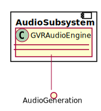

```PlantUML
@startuml Diagrams/AudioSubsystemClassDiagram
component AudioSubsystem {
    class AudioEngineController {

    }
}
AudioEngineController --() AudioGeneration
@enduml
```


#### 4.3.3 用例实现
@[参见软件设计模型](./顺序图.md)

#### 4.3.4 子系统协作

选择了能够体现子系统关系的几个用例进行说明。

##### DownloadVSS

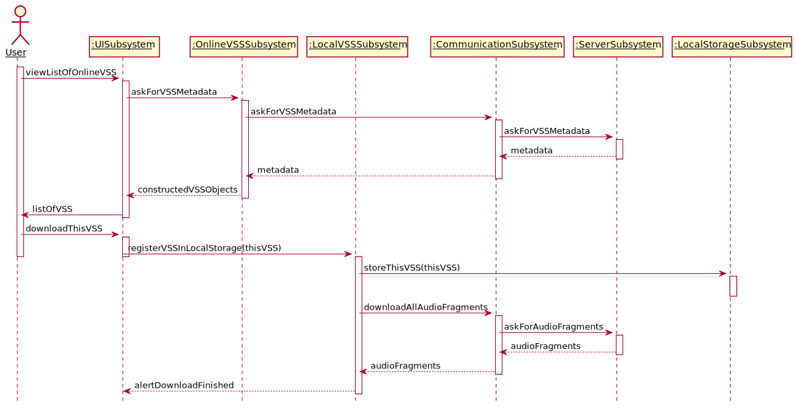

```PlantUML
@startuml Diagrams/DownloadVSSSystemSequenceDiagram
hide footbox
skinparam sequenceParticipant underline
actor "User" as user
participant ":UISubsystem" as ui
participant ":OnlineVSSSubsystem" as online
participant ":LocalVSSSubsystem" as local
participant ":CommunicationSubsystem" as com
participant ":ServerSubsystem" as server
participant ":LocalStorageSubsystem" as storage

activate user
    user -> ui: viewListOfOnlineVSS
activate ui
    ui -> online: askForVSSMetadata
activate online
    online -> com: askForVSSMetadata
activate com
    com -> server: askForVSSMetadata
activate server
    server --> com: metadata
deactivate server
    com --> online: metadata
deactivate com

    online --> ui: constructedVSSObjects
deactivate online
    ui -> user: listOfVSS
deactivate ui
    user -> ui: downloadThisVSS
activate ui
    ui -> local: registerVSSInLocalStorage(thisVSS)
deactivate ui
deactivate user
activate local
    local -> storage: storeThisVSS(thisVSS)
activate storage
deactivate storage
    local -> com: downloadAllAudioFragments
activate com
    com -> server: askForAudioFragments
activate server
    server --> com: audioFragments
deactivate server
    com --> local: audioFragments
deactivate com
    local --> ui: alertDownloadFinished
deactivate local
@enduml
```

##### UploadVSS

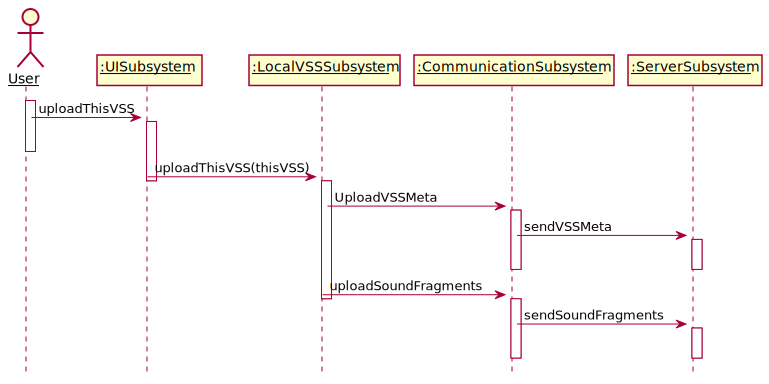

```PlantUML
@startuml Diagrams/UploadVSSSubsystemSequenceDiagram
hide footbox
skinparam sequenceParticipant underline

actor "User" as user
participant ":UISubsystem" as ui
participant ":LocalVSSSubsystem" as local
participant ":CommunicationSubsystem" as com
participant ":ServerSubsystem" as server

activate user
    user -> ui: uploadThisVSS
activate ui
deactivate user
    ui -> local: uploadThisVSS(thisVSS)
deactivate ui
activate local
    local -> com: UploadVSSMeta
activate com
    com -> server: sendVSSMeta
activate server
deactivate com
deactivate server
    local -> com: uploadSoundFragments
deactivate local

activate com
    com -> server: sendSoundFragments
activate server
deactivate server
deactivate com

@enduml
```

##### PlayConcertMode/MapModeVSS


```PlantUML
@startuml Diagrams/PlayVSSSubsystemSequenceDiagram
hide footbox
skinparam sequenceParticipant underline
actor "User" as user
participant ":UISubsystem" as ui
participant ":SensorSubsystem" as sensor
participant ":SensorHardwareWrapper" as hard
participant ":LocalVSSAccess" as local
participant ":AudioSubsystem" as audio

activate user
    user -> ui: playVSS
activate ui
    ui -> local: getSoundFragments
    activate local
    local --> ui: soundFragmentReferences
    deactivate local
    ui -> sensor: registerCallbacks
    activate audio
    activate hard
    activate sensor
    loop while playing
        hard -\ sensor: rawData
        sensor -\ audio: updateCurrentLocation
        user -\ ui: interaction
        ui -\ audio: controlCurrentPlayback

    end
@enduml
```

##### Register

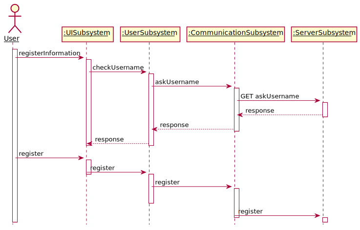

```PlantUML
@startuml Diagrams/RegisterSubsystemSequenceDiagram
hide footbox
skinparam sequenceParticipant underline
actor "User" as user
participant ":UISubsystem" as ui
participant ":UserSubsystem" as info
participant ":CommunicationSubsystem" as com
participant ":ServerSubsystem" as server

activate user
    user -> ui: registerInformation
activate ui
    ui -> info: checkUsername
    activate info
    info -> com: askUsername
activate com
    com -> server: GET askUsername
    activate server
    server --> com: response
    deactivate server
    com --> info: response
deactivate com
    info --> ui: response
deactivate info
deactivate ui
    user -> ui: register
activate ui
    ui -> info: register
deactivate ui

activate info
    info -> com: register
activate com
    deactivate info

    com -> server: register
deactivate com

activate server

@enduml
```

### 4.4 系统运行视图

总体上使用Android提供的多线程框架和事件系统进行实现。
ServerSubsystem通过Flask自带的服务器实现多线程处理。
Sensor子系统提供一个事件循环钩子接口，外界可以通过注册事件处理器实现事件控制。

此外SensorSubsystemWrapper和SensorSubsystem分别运行在单独的线程上。而不是运行在Android主线程上。

### 4.5 系统实现视图

#### 系统开发环境

*  Android Studio 3.0.1
*  Gradle 3.0.1
*  Android Support Library
*  Atom editor & PlantUML for document generation
*  VSCode editor & PlantUML & SVG extention for document generation
*  git & github for version control and team management
*  python3 & Flask for server
*  SQLite for on device storage
*  MySQL for server storage


### 4.6 系统物理视图


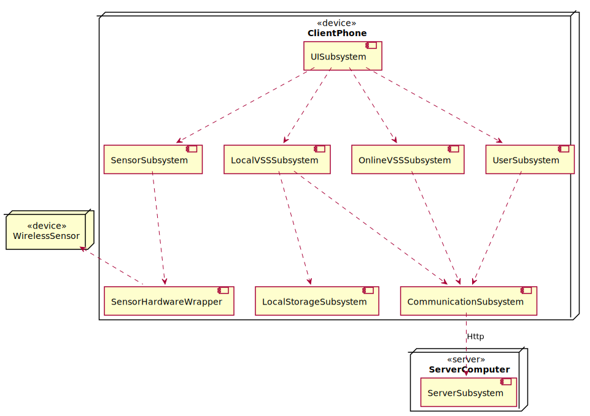

```PlantUML
@startuml Diagrams/DeploymentDiagram
skinparam componentStyle uml2

node ClientPhone <<device>> {
    component UISubsystem
    component SensorSubsystem
    component CommunicationSubsystem
    component LocalStorageSubsystem
    component LocalVSSSubsystem
    component OnlineVSSSubsystem
    component UserSubsystem
    component CommunicationSubsystem
    component SensorHardwareWrapper
    UISubsystem ..> UserSubsystem
    UISubsystem ..> OnlineVSSSubsystem
    UISubsystem ..> LocalVSSSubsystem
    SensorSubsystem ..> SensorHardwareWrapper
    UISubsystem ..> SensorSubsystem
    LocalVSSSubsystem ..> LocalStorageSubsystem
    UserSubsystem ..> CommunicationSubsystem
    OnlineVSSSubsystem ..> CommunicationSubsystem
    LocalVSSSubsystem ..> CommunicationSubsystem

}

node ServerComputer <<server>> {
    component ServerSubsystem
}

CommunicationSubsystem ..> ServerSubsystem: Http

node WirelessSensor <<device>>

WirelessSensor <.. SensorHardwareWrapper

@enduml
```
### 4.7 边界条件设计
| 用例名称 | AppOn |
| :---: | :--------- |
| **参与者** | 用户 |
| **范围** | 系统用例 |
| **前置条件** | App不在运行中 |
| **后置条件** | App完成初始化，用户进入LoginPage |
|| **主流程** |
|1|用户点击APP图标|
|2|系统创建LoginPage对象|
|3|LoginPage创建UserInfoControl对象|
|4|LoginPage创建AudioEngineController对象|
|5|LoginPage创建Runnable对象|
|| **扩展流程** |
||无|
| **特殊需求** |无|
| **发生频率** |经常，每次APP启动时会发生一次|
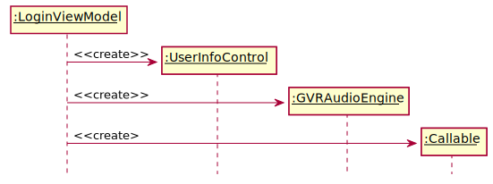

```PlantUML
@startuml Diagrams/AppOn
hide footbox
skinparam sequenceParticipant underline
Participant ":LoginPage" as LoginViewModel
Participant ":UserInfoControl" as UserInfoControl
Participant ":AudioEngineController" as GVRAudioEngine
Participant ":Runnable" as Callable

create UserInfoControl
LoginViewModel -> UserInfoControl: <<create>>
create GVRAudioEngine
LoginViewModel -> GVRAudioEngine: <<create>>
create Callable
LoginViewModel -> Callable: <<create>
@enduml
```

| 用例名称 | AppOff |
| :---: | :--------- |
| **参与者** | 用户 |
| **范围** | 系统用例 |
| **前置条件** | App在运行中 |
| **后置条件** | App关闭，退出界面 |
|| **主流程** |
|1|用户通过系统关闭APP|
|2|系统关闭各个Control对象|
|3|关闭Interface对象|
|| **扩展流程** |
||无|
| **特殊需求** |无|
| **发生频率** |经常，每次APP被用户主动关闭时会发生一次|


``` PlantUML
@startuml Diagrams/AppOff
hide footbox
skinparam sequenceParticipant underline
Participant ":LoginPage" as LoginViewModel
Participant ":UserInfoControl" as UserInfoControl
Participant ":AudioEngineController" as GVRAudioEngine
Participant ":Runnable" as Callable

LoginViewModel -> UserInfoControl: <<destroy>>
destroy UserInfoControl
LoginViewModel -> GVRAudioEngine: <<destroy>>
destroy GVRAudioEngine
LoginViewModel -> Callable: <<destroy>>
destroy Callable
LoginViewModel -> LoginViewModel: <<destroy>>
destroy LoginViewModel
@enduml
```

| 用例名称 | StartServer |
| :---: | :--------- |
| **参与者** | 用户 |
| **范围** | 系统用例 |
| **前置条件** | Server不在运行中 |
| **后置条件** | Server完成初始化 |
|| **主流程** |
|1|用户通过系统启动Server|
|2|系统创建Database对象|
|3|Database创建User对象|
|4|Database创建OnlineVSS对象|
|| **扩展流程** |
||无|
| **特殊需求** |无|
| **发生频率** |经常，每次Server启动时会发生一次|


```PlantUML
@startuml Diagrams/StartServer
hide footbox
skinparam sequenceParticipant underline
Participant ":Database" as db
Participant ":User" as User
Participant ":OnlineSoundSpaceLibrary" as Online

create User
db -> User: <<create>>
create Online
db -> Online: <<create>>
@enduml
```

| 用例名称 | StopServer |
| :---: | :--------- |
| **参与者** | 用户 |
| **范围** | 系统用例 |
| **前置条件** | Server在运行中 |
| **后置条件** | Server关闭，结束服务 |
|| **主流程** |
|1|用户通过系统关闭Server|
|2|系统关闭各个Database对象|
|3|关闭各个Data对象|
|4|系统断开与Server连接|
|| **扩展流程** |
||无|
| **特殊需求** |无|
| **发生频率** |经常，每次Server关闭时会发生一次|

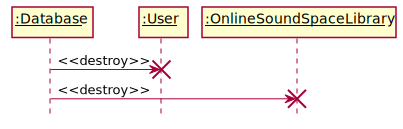

```PlantUML
@startuml Diagrams/StopServer
hide footbox
skinparam sequenceParticipant underline
Participant ":Database" as db
Participant ":User" as User
Participant ":OnlineSoundSpaceLibrary" as Online

db -> User: <<destroy>>
destroy User
db -> Online: <<destroy>>
destroy Online
@enduml
```

| 用例名称 | APPException |
| :---: | :--------- |
| **参与者** | 系统 |
| **范围** | 系统用例 |
| **前置条件** | APP在运行中，发生异常 |
| **后置条件** | APP正常运行 |
|| **主流程** |
|1|系统关闭APP|
|2|系统重新启动APP|
|| **扩展流程** |
||无|
| **特殊需求** |无|
| **发生频率** |少见，每次APP异常时会发生一次|

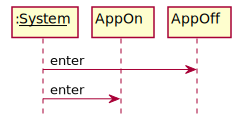

```PlantUML
@startuml Diagrams/APPException
hide footbox
Participant ":__System__" as System
Participant AppOn
Participant AppOff

System -> AppOff: enter
System -> AppOn: enter
@enduml
```

| 用例名称 | ServerException |
| :---: | :--------- |
| **参与者** | 系统 |
| **范围** | 系统用例 |
| **前置条件** | Server在运行中，发生异常 |
| **后置条件** | Server正常运行 |
|| **主流程** |
|1|系统关闭Server|
|2|系统重新启动Server|
|| **扩展流程** |
||Database依靠自身事务特性可以解决|
|1|Database自身解决|
|2|Server解决异常|
| **特殊需求** |无|
| **发生频率** |少见，每次Server异常时会发生一次|


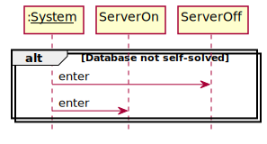

```PlantUML
@startuml Diagrams/ServerException
hide footbox
Participant ":__System__" as System
Participant ServerOn
Participant ServerOff

alt Database not self-solved
    System -> ServerOff: enter
    System -> ServerOn: enter
end
@enduml
```

### 4.8 数据管理设计
#### 4.8.1 服务器数据管理设计
服务器端数据库主要保存两大信息：
1. 各VSS的基本信息和评论点赞信息
2. 用户信息

服务器端数据库使用的系统为MySQL。该系统适合大型数据库的保存。

具体服务器表单设计如下：
##### VSSDatabase：VSS基本信息数据库

|表单|VSS_Table|||||||
|:-|:-|:-|:-|:-|:-|:-|:-|
|**字段**|**说明**|**数据类型**|**允许为空**|**数据类型**|**主键**|**单位**|**备注**|
|UserID|上传VSS的用户的ID|INT|N|Y|-|-|-|
|VSSID|VSS的本地ID（前两项作为VSS的唯一标示）|INT|N|Y|-|-|-|
|VSSDescription|VSS的简介|TEXT|Y|N|-|-|-|
|Username|上传VSS的用户名|VARCHAR|N|N|-|-|-|

|表单|SSTable|||||||
|:-|:-|:-|:-|:-|:-|:-|:-|
|**字段**|**说明**|**数据类型**|**允许为空**|**数据类型**|**主键**|**单位**|**备注**|
|UserID|上传VSS的用户的ID|INT|N|Y|-|-|-|
|VSSID|SS所属的VSS的ID|INT|N|Y|-|-|-|
|SFHash|该SS中的SF名字|CHAR(128)|N|Y|-|-|-|
|lng|SS的经度|FLOAT|Y|N|-|-|-|
|lat|SS的纬度|FLOAT|Y|N|-|-|-|
|height|SS的高度|FLOAT|Y|N|-|-|-|
|volume|SS的音量|INT|N|N|-|-|-|
|loopMode|SS的循环模式|INT|N|N|-|-|-|

|表单|SFTable|||||||
|:-|:-|:-|:-|:-|:-|:-|:-|
|**字段**|**说明**|**数据类型**|**允许为空**|**数据类型**|**主键**|**单位**|**备注**|
|SFHash|SF的MD5哈希值（用作文件名）|CHAR(128)|N|Y|-|-|-|

|表单|LikeTable|||||||
|:-|:-|:-|:-|:-|:-|:-|:-|
|**字段**|**说明**|**数据类型**|**允许为空**|**数据类型**|**主键**|**单位**|**备注**|
|UserID|上传VSS的用户的ID|INT|N|Y|-|-|-|
|VSSID|包含VSS的ID|INT|N|Y|-|-|-|
|LikeUserID|点赞者的ID|INT|N|Y|-|-|-|

|表单|CommentTable|||||||
|:-|:-|:-|:-|:-|:-|:-|:-|
|**字段**|**说明**|**数据类型**|**允许为空**|**数据类型**|**主键**|**单位**|**备注**|
|UserID|上传VSS的用户的ID|INT|N|Y|-|-|-|
|VSSID|VSS的ID|INT|N|Y|-|-|-|
|CommentUserID|评论者的ID|INT|N|N|-|-|-|
|CommentTime|评论的时间|TIME|N|N|-|-|-|
|CommentContent|评论内容|TEXT|N|N|-|-|-|

##### UserDatabase：存放用户数据的数据库

|表单|UserTable|||||||
|:-|:-|:-|:-|:-|:-|:-|:-|
|**字段**|**说明**|**数据类型**|**允许为空**|**数据类型**|**主键**|**单位**|**备注**|
|Username|用户名|VARCHAR|N|N|-|-|-|
|UserID|用户ID|INT|N|N|-|-|-|
|Email|用户邮箱|VARCHAR|N|N|-|-|-|
|Password|用户密码|VARCHAR|N|N|-|-|-|

#### 4.8.2 本地端数据管理设计
本地端数据库用于存储LocalVSSLibrary中的VSS数据，即
1. 各VSS的基本信息

本地端数据库使用SQLite，原因是（1）小巧轻便，适合本地端（2）安卓对SQLite有专门的软件开发包支持。

具体服务器表单设计如下：

|表单|VSS_Table|||||||
|:-|:-|:-|:-|:-|:-|:-|:-|
|**字段**|**说明**|**数据类型**|**允许为空**|**数据类型**|**主键**|**单位**|**备注**|
|UserID|上传该VSS的用户ID(若为用户自己的ID则表示用户自己制作该VSS)|N|Y|-|-|-|
|VSSID|VSS的本地ID（为VSS的唯一标示）|INT|N|Y|-|-|-|
|name|VSS
|description|VSS的简介|TEXT|Y|N|-|-|-|

|表单|SSTable|||||||
|:-|:-|:-|:-|:-|:-|:-|:-|
|**字段**|**说明**|**数据类型**|**允许为空**|**数据类型**|**主键**|**单位**|**备注**|
|UserID|上传该VSS的用户ID(若为用户自己的ID则表示用户自己制作该VSS)|INT|N|Y|-|-|-|
|VSSID|SS所属的VSS的ID|INT|N|Y|-|-|-|
|SFHash|该SS中的SF名字|CHAR(128)|N|Y|-|-|-|
|lng|SS的经度|FLOAT|Y|N|-|-|-|
|lat|SS的纬度|FLOAT|Y|N|-|-|-|
|height|SS的高度|FLOAT|Y|N|-|-|-|
|volume|SS的音量|INT|N|N|-|-|-|
|loop_mode|SS的循环模式|INT|N|N|-|-|-|


|表单|SFTable|||||||
|:-|:-|:-|:-|:-|:-|:-|:-|
|**字段**|**说明**|**数据类型**|**允许为空**|**数据类型**|**主键**|**单位**|**备注**|
|SFHash|SF的MD5哈希值（用作文件名）|CHAR(128)|N|Y|-|-|-|

### 4.9 其他设计
