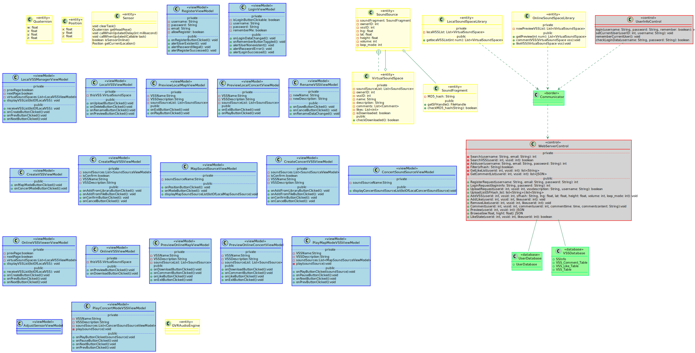

## AudioAR
# 软件设计模型

版本<1>

修订历史记录

|日期|版本|修订说明|作者|
|:-|:-|:-|:-|
|2018-04-27|0|提供基本的格式|刘知峻|
|2018-05-01|1|撰写引言部分|缪本杰|

## 1. 引言

### 1.1 编写目的
本文档拟定软件的设计模型，包括分解子系统、子系统之间的服务、子系统中的对象模型与详细的流程顺序图。本文档确定了项目开发时各系统的结构、细节与相互关系，指导之后的系统实现。

### 1.2 适用范围
此文档适用于AudioAR项目的全部软件及系统。

### 1.3 定义
相关定义见词汇表[@doc/需求定义和分析/词汇表.md](/需求定义和分析/词汇表.md)

### 1.4 参考资料
|文件标题|文件编号|发表日期|出版单位|来源|
|:-:|:-|:-|:-|:-|
|面向对象软件工程实践指南|ISBN9787313162182|2016年 12月 第1版|上海交通大学出版社|图书资料|
|软件设计模型模版|-|-|-|课程资料|

### 1.5 概述
本文档通过[用例视图](#2用例视图)、[逻辑视图](#3逻辑视图)、[实现视图](#4实现视图)、[进程视图](#5进程视图)、[部署视图](#6部署视图)来阐释系统设计模型。

## 2. 用例视图

关于用例部分，详见[@软件需求规约#用例模型](../需求定义和分析/用例模型.md)

## 3. 逻辑视图

### 3.1 系统结构

详见[@软件架构文档#系统逻辑视图](./软件架构文档.md#43-系统逻辑视图)

### 3.2 Use-Case实现

详见[@用例顺序图](./顺序图.md)

### 3.3 设计类图

### 3.4 其他图

## 4. 实现视图

## 5. 进程视图

UI线程之外，AudioEngineController使用了一个线程，BaiduMap使用了自身的线程，GVRAudioEngine、Sensor部分分别包含自身的线程。Sensor线程调用UI现成的方法实现消息通知。

## 6. 部署视图

系统是一个移动系统，采用手机app作为客户端，服务器在后台，通过数据库进行数据存储。

详见[@./软件架构文档.md#46-系统物理视图](./软件架构文档.md#46-系统物理视图)
