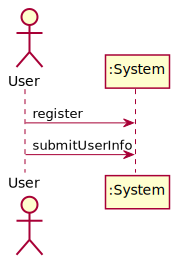
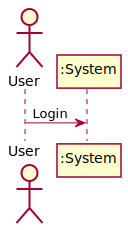
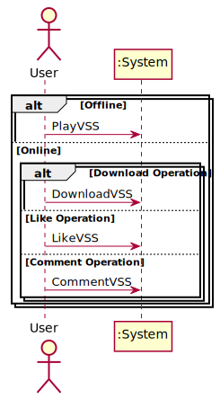
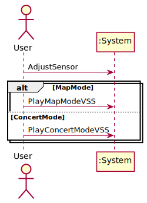
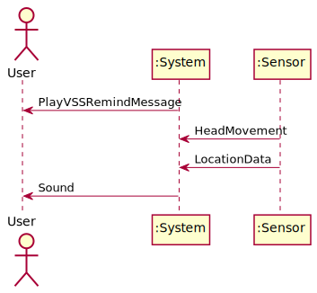

##### 系统顺序图&操作契约

###### 用例1：Register



```
@startuml
actor User
participant ":System"
User -> ":System" : register
User -> ":System" : submitUserInfo 
@enduml
```

###### 契约CO1：submitUserlnfo 

|   契约名称   |                        submitUserInfo                        |
| :----------: | :----------------------------------------------------------: |
|   **操作**   | submitUserInfo(username: Username; password: Password; e-mail: E-mail; userID: UserID) |
| **交叉引用** |                           Register                           |
| **前置条件** |                         用户请求注册                         |
| **后置条件** |                                                              |
|              |                        创建User实例u                         |
|              |                     u.userID赋值为UserID                     |
|              |                   u.userName赋值为Username                   |
|              |                   u.password赋值为Password                   |
|              |                     u.email赋值为E-mail                      |

###### 用例2：Login 



```
@startuml
actor User
participant ":System"
User -> ":System" : Login
@enduml
```

###### 用例3：ManageLocalVSSLibrary


```
@startuml
actor User
participant ":System"
User -> ":System": manageLocalVSSLibrary
alt Create Operation
  User -> ":System": CreateVSS
else Rename Operation
  User -> ":System": RenameVSS
else Delete Operation
  User -> ":System": DeleteVSS
else Upload Operation
  User -> ":System": UploadVSS
else Preview Operation
  User -> ":System": PreviewVSS
end
User -> ":System": saveManageChange
@enduml
```

###### 用例4：CreateVSS


```
@startuml
actor User
participant ":System"
alt MapMode
  User -> ":System": CreateMapModeVSS
else ConcertMode
  User -> ":System": CreateConcertModeVSS
end
@enduml
```

###### 用例5：CreateMapModeVSS


```
@startuml
actor User
participant ":System"
User -> ":System" : LocationData
User -> ":System" : CreateMapModeVSS
@enduml
```

###### 契约CO2：CreateMapModeVSS

|   契约名称   |                       CreateMapModeVSS                       |
| :----------: | :----------------------------------------------------------: |
|   **操作**   | CreateMapModeVSS(VSSTrack: VSSTrack; VSSLocationData: VSSLocationData; VSSName: VSSName; VSSID: VSSID) |
| **交叉引用** |                 CreateVSS; CreateMapModeVSS                  |
| **前置条件** |      用户已登录，进入本地虚拟声音空间（VSS）库管理界面       |
| **后置条件** |                                                              |
|              |           本地虚拟声音空间（VSS）库中添加VSS实例v            |
|              |                      v.VSSID赋值为VSSID                      |
|              |                  v.soundTrack赋值为VSSTrack                  |
|              |                     v.name赋值为VSSName                      |
|              |             v.locationData复制为VSSLocationData              |

###### 用例6：CreateConcertModeVSS


```
@startuml
actor User
participant ":System"
User -> ":System" : CreateConcertModeVSS
@enduml
```

###### 契约CO3：CreateConcertModeVSS

|   契约名称   |                     CreateConcertModeVSS                     |
| :----------: | :----------------------------------------------------------: |
|   **操作**   | CreateConcertModeVSS(VSSTrack: VSSTrack; VSSName: VSSName; VSSID: VSSID) |
| **交叉引用** |               CreateVSS; CreateConcertModeVSS                |
| **前置条件** |      用户已登录，进入本地虚拟声音空间（VSS）库管理界面       |
| **后置条件** |                                                              |
|              |           本地虚拟声音空间（VSS）库中添加VSS实例v            |
|              |                      v.VSSID赋值为VSSID                      |
|              |                  v.soundTrack赋值为VSSTrack                  |
|              |                     v.name赋值为VSSName                      |

###### 用例7：RenameVSS


```
@startuml
actor User
participant ":System"
User -> ":System": RenameVSS
@enduml
```

###### 契约CO4：RenameVSS

|   契约名称   |                     RenameVSS                     |
| :----------: | :-----------------------------------------------: |
|   **操作**   |    RenameVSS( VSSName: VSSName; VSSID: VSSID)     |
| **交叉引用** |         ManageLocalVSSLibrary; RenameVSS          |
| **前置条件** | 用户已登录，进入本地虚拟声音空间（VSS）库管理界面 |
| **后置条件** |                                                   |
|              |      依据 VSSID 与 v.VSSID 的匹配找到对应 v       |
|              |                v.name赋值为VSSName                |

###### 用例8：DeleteVSS


```
@startuml
actor User
participant ":System"
User -> ":System": DeleteVSS
":System" -> User: AskIfDeletion
User -> ":System": ConfirmDeletion
@enduml
```

###### 契约CO5：DeleteVSS

|   契约名称   |                     DeleteVSS                     |
| :----------: | :-----------------------------------------------: |
|   **操作**   |              DeleteVSS(VSSID: VSSID)              |
| **交叉引用** |         ManageLocalVSSLibrary; DeleteVSS          |
| **前置条件** | 用户已登录，进入本地虚拟声音空间（VSS）库管理界面 |
| **后置条件** |                                                   |
|              |      依据 VSSID 与 v.VSSID 的匹配找到对应 v       |
|              |      将v实例从本地虚拟声音（VSS）空间中移除       |

###### 用例9：UploadVSS


```
@startuml
actor User
participant ":System"
":System" -> User: RemindUploading
User -> ":System": UploadVSS
@enduml
```

###### 契约CO6：UploadVSS

|   契约名称   |                       UploadVSS                       |
| :----------: | :---------------------------------------------------: |
|   **操作**   |                UploadVSS(VSSID: VSSID)                |
| **交叉引用** |                       UploadVSS                       |
| **前置条件** |      用户已登录，通过本地VSS库管理界面进入该用例      |
| **后置条件** |                                                       |
|              |        依据 VSSID 与 v.VSSID 的匹配找到对应 v         |
|              | 将本地虚拟声音空间v对象上传到在线虚拟生你声音空间库中 |
|              |           将v对象从本地虚拟声音空间库中删除           |

######用例10：PreviewVSS



```
@startuml
actor User
participant ":System"
alt Offline
  User -> ":System": PlayVSS
else Online
  alt Download Operation
      User -> ":System": DownloadVSS
  else Like Operation
      User -> ":System": LikeVSS
  else Comment Operation
      User -> ":System": CommentVSS
  end
end
@enduml
```

###### 用例11：LikeVSS


```
@startuml
actor User
participant ":System"
User -> ":System": LikeVSS
":System" -> User: LikeUserList
@enduml
```

###### 契约CO7：LikeVSS

|   契约名称   |                LikeVSS                 |
| :----------: | :------------------------------------: |
|   **操作**   |         LikeVSS(VSSID: VSSID)          |
| **交叉引用** |          PreviewVSS; LikeVSS           |
| **前置条件** |   用户在预览在线虚拟声音空间（VSS）    |
| **后置条件** |                                        |
|              | 依据 VSSID 与 v.VSSID 的匹配找到对应 v |
|              |             v.like的值加1              |
|              |     v.likeUserList中加入点赞用户u      |

###### 用例12：DownloadVSS 


```
@startuml
actor User
participant ":System"
User -> ":System": DownloadVSS
":System" -> User: VSSData
@enduml
```

###### 用例13：CommentVSS 


```
@startuml
actor User
participant ":System"
User -> ":System": CommentVSS
":System" -> User: HistroyComments
@enduml
```

######契约CO8：CommentVSS

|   契约名称   |                 CommentVSS                 |
| :----------: | :----------------------------------------: |
|   **操作**   | CommentVSS(comment: Comment; VSSID: VSSID) |
| **交叉引用** |           PreviewVSS; CommentVSS           |
| **前置条件** |     用户在预览在线虚拟声音空间（VSS）      |
| **后置条件** |                                            |
|              |  本地虚拟声音空间（VSS）库中添加VSS实例v   |
|              |       v.commentList中加入一项Comment       |

###### 用例14：PlayVSS 



```
@startuml
actor User
participant ":System"
User -> ":System": AdjustSensor
alt MapMode
  User -> ":System": PlayMapModeVSS
else ConcertMode
  User -> ":System": PlayConcertModeVSS
end
@enduml
```

###### 用例15：PlayMapModeVSS 



```
@startuml
actor User
participant ":System"
participant ":Sensor"
":System" -> User: PlayVSSRemindMessage
":Sensor" -> ":System": HeadMovement
":Sensor" -> ":System": LocationData
":System" -> User: Sound
@enduml
```

###### 用例16：PlayConcertModeVSS 


```
@startuml
actor User
participant ":System"
participant ":Sensor"
":System" -> User: PlayVSSRemindMessage
":Sensor" -> ":System": HeadMovement
":System" -> User: Sound
@enduml
```

###### 用例17：BrowseOnlineVSSLibrary 


```
@startuml
actor User
participant ":System"
User -> ":System": BrowseOnlineVSSLibrary
":System" -> User: VSSList
User -> ":System": PreviewVSS
@enduml
```

###### 用例18：AdjustSensor 


```
@startuml
actor User
participant ":System"
":System" -> User: SystemRemindMessage
User -> ":System": AdjustSensor
@enduml
```


